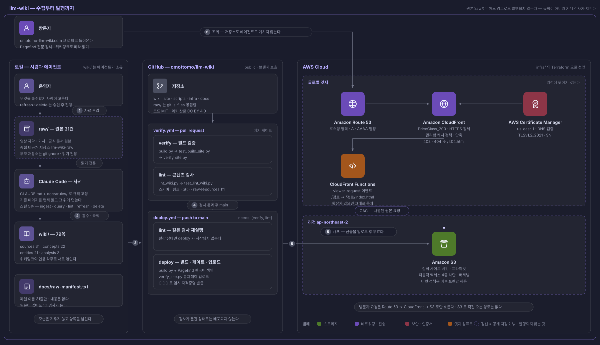
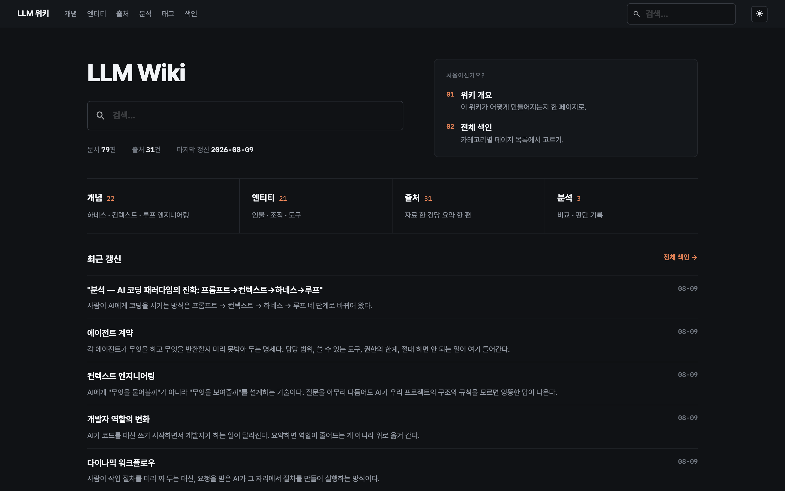
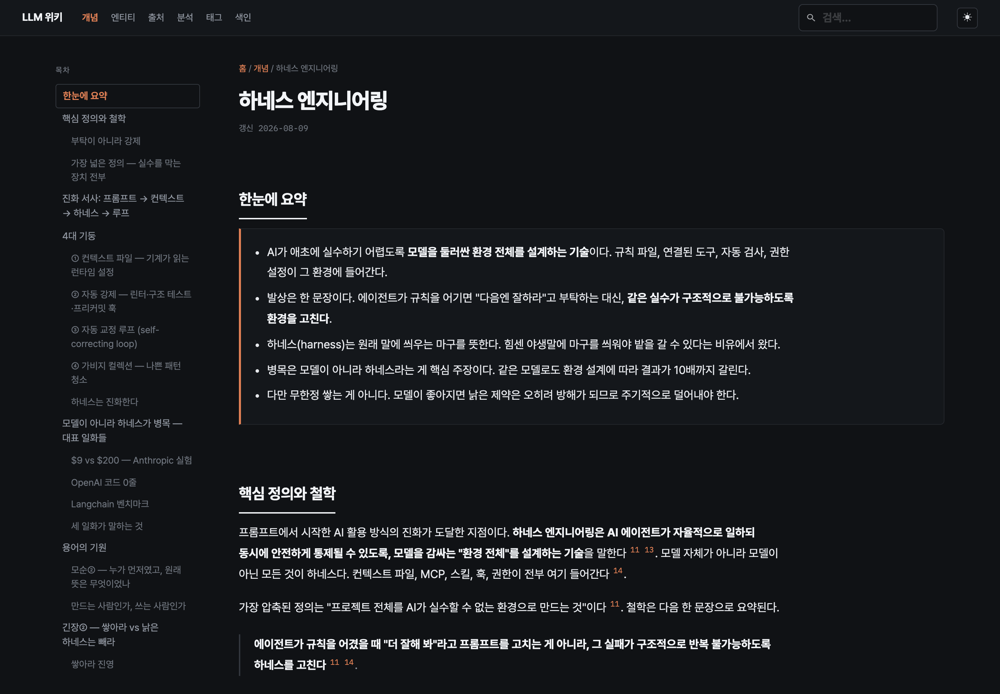
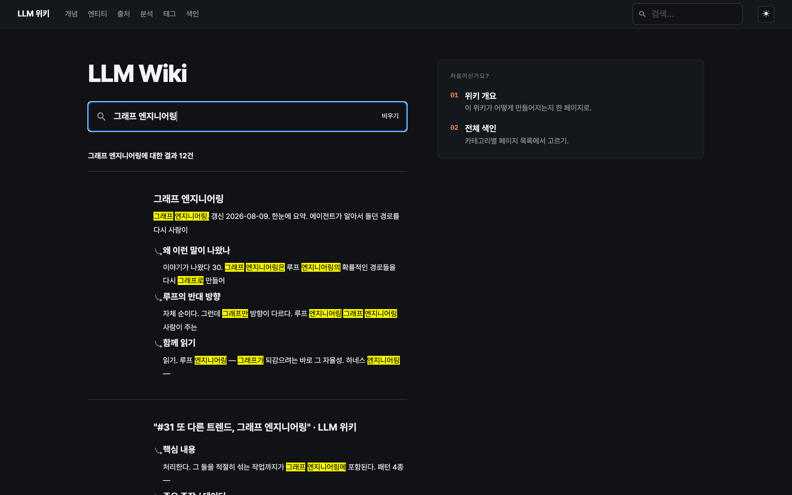

# llm-wiki

에이전트가 사서(librarian) 역할로 운영하는 개인 지식 위키. 읽은 자료를 요약하고 버리는 대신
구조화된 페이지로 누적·연결하고, 정적 사이트로 발행한다.

읽을 수 있는 결과물: **<https://omotomo-llm-wiki.com>**

## Architecture



**수집** — 영상 자막·기사·공식 문서를 `raw/`에 원본 그대로 넣고, 에이전트가 `wiki-ingest`
스킬로 읽는다. 원본 1건에 `wiki/sources/` 요약 1쪽이 1:1로 대응하도록 구성했고, 스킬은
용도별로 다섯 개다 — 흡수(`ingest`), 질의(`query`), 점검(`lint`), 최신화(`refresh`),
삭제(`delete`). 최신화와 삭제는 사람이 확인해야 진행되는 게이트를 달았다.

**축적** — 매번 새로 요약하지 않고 기존 페이지를 먼저 읽은 뒤 그 위에 덧쓴다. 자료 하나가
개념·인물·분석 페이지 여러 쪽으로 쪼개져 들어가고 위키링크로 서로 엮인다. 새 자료가 기존
서술과 충돌하면 어느 쪽도 지우지 않고 양쪽을 남긴 뒤 **모순으로 표시**한다 — 현재 코퍼스에도
용어 기원·기법 위상을 두고 갈리는 모순 항목이 그대로 보존돼 있다. `scripts/lint_wiki.py`가
frontmatter 스키마, 끊긴 위키링크, 고아 페이지, 필수 헤딩, `raw ↔ sources` 1:1 짝을 검사한다.

**발행** — `site/build.py`가 `wiki/*.md`만 읽어 정적 HTML로 렌더하고 Pagefind 한국어 전문
검색을 붙인다. 프레임워크도 정적 사이트 생성기도 없는 단일 파이썬 스크립트이며, 목차·백링크·
인용 각주·태그 색인·사이트맵을 빌드 타임에 만들어 낸다. 배포는 Terraform으로 정의한
AWS S3 + CloudFront(OAC·ACM·Route53)로 가고, GitHub Actions가 PR에서 검증하고
`main`에서만 배포한다. 배포 job은 `needs: [verify, lint]`로 검증 job에 묶여 있어 검사가
빨간 상태로는 사이트가 올라가지 않는다.

**조회** — 방문자는 저장소도 에이전트도 거치지 않고 도메인으로 바로 들어온다. 요청은
Route 53 → CloudFront → S3 로만 흐르고, 버킷은 프라이빗이라 S3 로 직접 오는 경로가 없다.
CloudFront Function이 `/경로`를 `/경로/index.html`로 바꿔 주고 403·404는 `/404.html`로 보낸다.
읽는 쪽에 필요한 검색·목차·백링크는 전부 빌드 타임에 만들어져 있어 서버도 데이터베이스도 없다.

**원본 격리** — `raw/`는 제3자 저작물이라 이 공개 저장소에 포함하지 않는다. 별도 비공개
저장소(`omottomo/llm-wiki-raw`)를 `raw/` 자리에 중첩시키고 부모는 gitignore 했으며, 파일 이름
목록만 `docs/raw-manifest.txt`로 남겨 **원본 없이도 1:1 검사가 돌아간다**. 경계는 규칙이 아니라
기계 검사가 지킨다 — `scripts/verify_site.py`가 `git ls-files raw/`가 비어 있는지, 빌드된
`dist/`에 원본 문장이 새지 않았는지 매번 확인하고, 어긋나면 빌드를 실패시킨다.

## Why

읽은 자료의 요약이 전부 대화창에 흩어져 남았다. 챗봇은 같은 주제를 물을 때마다 처음부터 다시
요약하고, 지난번에 읽은 것과 이어 붙이지 않는다 — 자료가 늘어도 답은 좋아지지 않는다.
그래서 대화 대신 **저장소**로 만들고, 에이전트에게는 답변자가 아니라 사서 역할을 줬다.
새 자료가 들어오면 기존 페이지를 먼저 찾아 읽고 그 위에 덧쓰게, 충돌하면 지우는 대신 양쪽을
남기고 모순으로 표시하게 규칙을 고정했다. 성공 기준은 두 가지다. 자료가 쌓일수록 답이 좋아질
것, 그리고 그 결과가 나만 보는 폴더가 아니라 **누구나 검색해서 읽을 수 있는 사이트**로 남을 것.

## Repository Structure

```
.
├── CLAUDE.md                    # 에이전트 공통 운영 규칙 — 두 모드, 스킬 라우팅, 언어 규칙
├── .claude/skills/              # 위키 스킬 5종 (ingest · query · lint · refresh · delete)
│
├── raw/                         # 원본 자료 31건 — 읽기 전용. 비공개 중첩 저장소, 여기엔 목록만
├── wiki/                        # 에이전트가 쓰고 고치는 결과물 (79쪽)
│   ├── sources/                 #   자료별 요약 31쪽 (raw 1건 = 1쪽)
│   ├── concepts/                #   개념·주제 22쪽
│   ├── entities/                #   인물·조직·제품 21쪽
│   ├── analysis/                #   질문에 답한 뒤 남길 가치가 있는 비교·분석 3쪽
│   └── index.md, overview.md    #   전체 목록과 운영 방식 개관
│
├── site/
│   ├── build.py                 # wiki/*.md → 정적 HTML + Pagefind 검색 (단일 스크립트)
│   ├── style.css
│   └── test_build_site.py       # 빌드 산출물 테스트
├── scripts/
│   ├── lint_wiki.py             # 스키마 · 링크 · 고아 · raw↔sources 1:1 검사
│   ├── verify_site.py           # 발행 경계 감사 (raw 유출 · 미해석 위키링크)
│   └── test_lint_wiki.py        # 골든/결함 픽스처 테스트
├── infra/                       # Terraform — S3 + CloudFront + ACM + Route53 + OIDC 배포 역할
├── .github/workflows/           # verify.yml (PR 게이트) · deploy.yml (main 배포)
└── docs/                        # 운영 문서 — 규칙 2종 · 단계별 계획 15개 · 작업 로그
```

## Results



발행된 위키 홈 — 검색과 시작 경로, 최근 갱신



위키 페이지 — 자동 목차, 인용 각주, 백링크



Pagefind 한국어 전문 검색

## Documentation

| | |
|---|---|
| [운영 규칙](CLAUDE.md) | 에이전트 공통 규칙 — 두 가지 모드, 스킬 라우팅, 언어 규칙 |
| [콘텐츠 규칙](docs/rules/wiki-content.md) | 페이지 작성 · 분류 · 쉬운글 규칙 · 인덱스 유지 |
| [사이트/코드 규칙](docs/rules/site-code.md) | 빌드 · 배포 · 검증 순서와 누적된 제약 |
| [문서 카탈로그](docs/index.md) | `docs/` 아래 전체 목록과 단계별 계획 15개 |
| [작업 로그](docs/log.md) | 날짜별 작업 이력 (append-only) |

## 라이선스

성격이 다른 두 가지가 한 저장소에 있어 라이선스도 둘로 나뉜다.

| 대상 | 라이선스 |
|---|---|
| 코드 — `scripts/`, `site/`, `infra/`, `.github/`, `.claude/` | [MIT](LICENSE) |
| 위키 산문 — `wiki/` | [CC BY 4.0](https://creativecommons.org/licenses/by/4.0/deed.ko) |

`wiki/` 페이지는 남의 영상과 글을 근거로 쓴 요약·재구성이고 모든 쪽이 frontmatter에
출처를 달고 있다. 그래서 출처 표시를 요구하는 CC BY를 쓴다.
