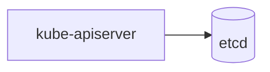
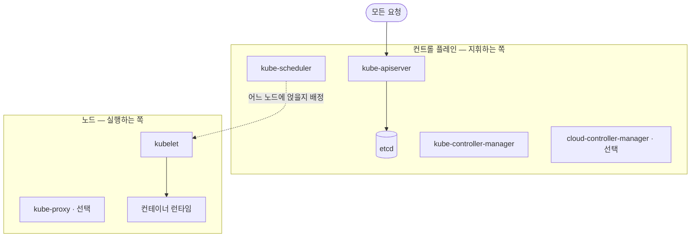

# phase-18-wiki-diagrams — Implementation Plan

> **For agentic workers:** REQUIRED SUB-SKILL: Use superpowers:subagent-driven-development (recommended) or superpowers:executing-plans to implement this plan task-by-task. Steps use checkbox (`- [ ]`) syntax for tracking.

**Goal:** Let concept and entity pages carry Mermaid diagrams — rendered on the site, validated by lint, produced by the ingest flow and a new backfill skill — so a reader no longer rebuilds architectures and flows from prose alone.

**Architecture:** Diagrams are Mermaid fenced blocks inside the page markdown (no image files). `site/build.py` gets a markdown-it fence hook that emits `<pre class="mermaid">` and appends a pinned-CDN module script only on pages that have one; `scripts/lint_wiki.py` gets `check_diagrams`, which validates form (type, caption, citation, cap, scope, section) but never requires presence. The content rules land in `docs/rules/wiki-content.md` §1.4; `wiki-ingest` draws at write time and a new `wiki-illustrate` skill backfills existing pages in a later content-mode session.

**Tech Stack:** Python 3.12 stdlib + `markdown-it-py==4.2.0` (already in `site/requirements.txt`), Mermaid `11.17.2` from jsdelivr (ESM, browser-side), the existing assert-based test runners (`site/test_build_site.py`, `scripts/test_lint_wiki.py`), Pagefind (unchanged).

**Spec:** `docs/tasks/phase-18-wiki-diagrams/plan.md` — the plan argues from it; read both.

## Global Constraints

- **Language rule (CLAUDE.md).** Operating files (`docs/rules/*`, `.claude/skills/*`, `CLAUDE.md`, this plan) are English. Everything under `wiki/` — including diagram labels and captions — is Korean. Chat with the user is Korean.
- **`raw/` is read-only and never published.** Nothing in this phase reads or writes `raw/`.
- **Verification order for any task touching the site** (`docs/rules/site-code.md` §2.3): `python3 scripts/lint_wiki.py` → `python3 site/build.py` → `python3 scripts/verify_site.py`. Run `python3 site/test_build_site.py` and `python3 scripts/test_lint_wiki.py` wherever a task changes what they cover.
- **Mermaid version pinned to `11.17.2`** (last 11.x; 12.0.0 is one week old). CDN URL exactly: `https://cdn.jsdelivr.net/npm/mermaid@11.17.2/dist/mermaid.esm.min.mjs`.
- **Allowed diagram types, verbatim:** `flowchart`, `sequenceDiagram`, `classDiagram`, `stateDiagram-v2`, `timeline`.
- **Caption form, verbatim:** `*그림 N. <설명> (→ [[sources/<slug>|label]])*` — italic, numbered from 1 per page, at least one `[[sources/…]]` citation.
- **Cap:** at most 3 figures per page (Mermaid blocks and `/assets/` images count together, and share the `그림 N` numbering).
- **Scope:** diagrams only on pages whose frontmatter `type` is `concept` or `entity`.
- **Git (git-workflow skill):** branch `feat/wiki-diagrams` (already created from `origin/main`); commit title English Conventional Commits ≤72 chars; body Korean per `.claude/git-message-template.md` (`- 무엇:` / `- 왜:` / `- 영향:`, drop empty fields); trailer `Task: wiki-diagrams`; then `Co-Authored-By: Claude Opus 5 (1M context) <noreply@anthropic.com>`. Never commit on `main`. Never `--no-verify`.
- **No `prd.json`** — this plan is the task list. `docs/index.md` must be updated whenever a file under `docs/` is added (both `plan.md` and `implementation.md` are already registered; Task 8 flips the status).
- **Fixtures** live under `tests/fixtures/` (golden: `tests/fixtures/golden-wiki/`, defects: `tests/fixtures/defects/<name>/` each with `expect.txt`, `raw/`, `wiki/`). `scripts/test_lint_wiki.py` discovers defect directories automatically.
- **Ponytail marker:** a deliberate corner with a known ceiling gets a `# ponytail:` comment naming the upgrade path (used once, in Task 2, for "Mermaid syntax is not parsed").

---

## Context an implementer needs before Task 1

**How a page is rendered today.** `site/build.py` (`render_article`, lines ~467–510) runs `strip_internal_sections` → `render_citations` → `link_wikilinks` → `md.render` → `add_toc` → `split_h1` → `base_html`. `render_citations` and `link_wikilinks` both wrap their transform in `outside_fences`, so text inside any ```` ``` ```` fence reaches markdown-it untouched. `md` is a module-level `MarkdownIt("commonmark", {"html": True}).enable("table").enable("strikethrough")`. markdown-it-py's default fence renderer is the bound method `md.renderer.rules["fence"]`; `md.add_render_rule("fence", fn)` replaces it with `fn.__get__(md.renderer)`, so `fn` takes `(self, tokens, idx, options, env)` and the token exposes `.info` (the fence info string) and `.content`.

**Verified in a REPL (markdown-it-py 4.2.0):** a hook that returns `<pre class="mermaid" data-pagefind-ignore>{html.escape(content)}</pre>\n` for `info == "mermaid"` and delegates to the saved default otherwise renders ```` ```python ```` fences unchanged and turns ```` ```mermaid ```` into the `<pre>`. The escape turns `-->` into `--&gt;`; the browser decodes it back when the script reads `el.textContent`, so the source Mermaid receives is exact.

**Theme.** `base_html` sets `document.documentElement.dataset.theme` from `localStorage` before paint (dark is the default) and registers a click handler on `#theme-toggle` that flips it. A `<script type="module">` appended later in `<body>` registers its own click handler *after* that one, so on toggle the theme attribute is already updated when the diagram re-renders.

**Lint.** `scripts/lint_wiki.py` collects errors with `add(category, message)` (drives exit code 1) and warnings with `warn(category, message)` (exit 0, printed under "가독성 경고"). `split_body(text)` returns the body after frontmatter; `parse_frontmatter(text)` returns a dict or `None`. `FENCE_RE = re.compile(r"```.*?```", re.S)` already exists. Checks are called in order in `main()` after `check_page_structure(pages)`. The success line in `main()` lists every passing category — extend it.

**Tests.** Both runners are plain scripts: every module-level `test_*` function runs in name order; `site/test_build_site.py` first runs the real build and inspects `site/dist/`. `scripts/test_lint_wiki.py` lints the golden fixture (must exit 0) and every `tests/fixtures/defects/*` directory (must exit 1 and print the substring in `expect.txt`).

**Existing style hooks.** `site/style.css` line ~138: `article pre { background: var(--code-bg); padding: 1rem; border-radius: 6px; overflow-x: auto; border: 1px solid var(--line); }`. Colour tokens available: `--faint`, `--line`, `--code-bg`, `--accent`, `--bg`, `--text`.

---

## File structure

| File | Change | Responsibility |
|---|---|---|
| `docs/rules/wiki-content.md` | Modify — new §1.4 after §1.3; header line lists `wiki-illustrate` | The content rules for diagrams and the official-image exception |
| `docs/rules/site-code.md` | Modify — one bullet in §2.4 | Records the Mermaid CDN dependency and its escape hatch |
| `CLAUDE.md` | Modify — §1 tree comment, §3 content-mode list | Routes "그림 넣어 / 시각화 / 도식 / illustrate" to `wiki-illustrate` |
| `scripts/lint_wiki.py` | Modify — constants, `check_diagrams`, `main()` | Validates the form of every diagram/figure on every page |
| `tests/fixtures/golden-wiki/wiki/concepts/foo-concept.md` | Modify | One valid diagram so the golden path is exercised |
| `tests/fixtures/defects/diagram-*/` (6 dirs) | Create | One defect each: type, caption, citation, cap, scope, summary-section |
| `site/build.py` | Modify — `MERMAID_*` constants, `fence` rule, `mermaid_script_for`, `copy_assets`, `base_html(extra_scripts=…)`, `render_article`, `main` | Renders diagrams and mirrors `wiki/assets/` |
| `site/test_build_site.py` | Modify — 5 new tests | Fence hook, script gating, assets copy, CSS presence, pilot page |
| `site/style.css` | Modify — diagram/caption/asset rules | Layout of figures in both themes |
| `scripts/verify_site.py` | Modify — `check_assets_parity`, `main()` | `wiki/assets/` ↔ `dist/assets/` byte parity |
| `.claude/skills/wiki-ingest/SKILL.md` | Modify — §1 and §4-2 | Draw at ingest; surface official-image candidates |
| `.claude/skills/wiki-illustrate/SKILL.md` | Create | Backfill skill for existing pages |
| `wiki/concepts/kubernetes.md` | Modify — one diagram + caption, `updated` bump | Pilot through the whole pipeline |
| `docs/index.md`, `docs/log.md` | Modify | Catalog entry for `implementation.md`; one `site` log line at close-out |

---

### Task 1: Rules and routing

**Files:**
- Modify: `docs/rules/wiki-content.md` (header note lines 3–6; insert §1.4 immediately before the line `### Source summary page (\`sources/\`) — required template`)
- Modify: `docs/rules/site-code.md` (§2.4 "Accumulated rules" — append one bullet at the end of the list)
- Modify: `CLAUDE.md` (§1 tree comment on `.claude/skills/`; §3 content-mode list)

**Interfaces:**
- Produces: the rule text that Task 2's lint messages and Task 6's skills cite by section number (`docs/rules/wiki-content.md` §1.4).

- [ ] **Step 1: Add §1.4 to `docs/rules/wiki-content.md`**

Insert the following block directly before `### Source summary page (\`sources/\`) — required template` (keep one blank line on each side):

`````markdown
### 1.4 그림 — Mermaid diagrams on concept and entity pages (phase-18)

A page that explains an architecture, a flow or a hierarchy may carry a diagram. Diagrams are
**Mermaid fenced blocks inside the page**, never separate files; GitHub renders them in the
`wiki/*.md` preview and the site renders them in the browser (`site/build.py`, pinned CDN build).
`scripts/lint_wiki.py` `check_diagrams` enforces the form below; it never requires a diagram —
whether a page *needs* one is the librarian's call at ingest (`wiki-ingest` §4) or backfill
(`wiki-illustrate`).

**Form.** A fence followed by a caption:

````markdown

*그림 1. 컨트롤 플레인의 요청 흐름 (→ [[sources/kubernetes-components|#34 쿠버네티스 컴포넌트]])*
````

**Rules (lint-checked unless marked "judgement").**

1. **Placement.** Directly after the prose of the section it illustrates — prose first, diagram
   after. Never inside `## 한눈에 요약`.
2. **Caption required.** The line after the fence (one blank line allowed) is
   `*그림 N. <설명> (→ [[sources/<slug>|label]])*` — italic, numbered from 1 per page, with at
   least one `[[sources/…]]` citation in the §4.2 alias form. A diagram is a claim; an uncited
   diagram is an uncited claim.
3. **Labels reuse body terms** *(judgement)*. Every node label is a term the body already uses,
   in Korean where the body uses Korean. Do not draw a component or an arrow that the body — and
   its cited source — does not state.
4. **Cap.** At most **3** figures per page; 1 is the norm. Mermaid blocks and `/assets/` images
   count together and share the `그림 N` numbering.
5. **Allowed types** — the first line of the fence starts with one of `flowchart`,
   `sequenceDiagram`, `classDiagram`, `stateDiagram-v2`, `timeline`. Anything else fails lint, so
   a page never ships a block the pinned Mermaid build cannot render.
6. **Draw only when** *(judgement)* one of these holds **and a table would not do the job**:
   ≥3 components with relationships between them; a flow of ≥3 steps; a layered or containment
   hierarchy.
7. **Scope.** `concepts/` and `entities/` only (`type: concept | entity`). A diagram on a
   `source`, `analysis` or `overview` page fails lint.

**Official-documentation image exception.** A third-party image may be embedded only when the
ingested source is official documentation carrying an explicit licence (e.g. kubernetes.io,
CC BY 4.0). Store it at `wiki/assets/<page-slug>/<name>.png|svg` and reference it as
`` followed by the same caption form plus origin and
licence: `*그림 N. … (출처: <URL>, CC BY 4.0) (→ [[sources/…|…]])*`. Lint fails an `/assets/`
image whose file is missing or whose caption carries no licence marker (`CC BY`, `CC0`, `Apache`,
`MIT`, `public domain`, `퍼블릭 도메인`). **Human gate:** the agent posts the candidate (URL, the
licence text as found on the page, what it shows) in chat and writes nothing under `wiki/assets/`
until the human approves. No general web image search — `wiki/` is public, and an unlicensed
copy is a copyright exposure.
`````

- [ ] **Step 2: Mention `wiki-illustrate` in the module header**

In `docs/rules/wiki-content.md` lines 4–5, change

```
> **Read this before creating or editing anything under `wiki/`.** It governs the librarian
> skills (`wiki-ingest` / `wiki-query` / `wiki-lint` / `wiki-delete` / `wiki-refresh`) and any
```

to

```
> **Read this before creating or editing anything under `wiki/`.** It governs the librarian
> skills (`wiki-ingest` / `wiki-query` / `wiki-lint` / `wiki-delete` / `wiki-refresh` / `wiki-illustrate`) and any
```

- [ ] **Step 3: Add the CDN bullet to `docs/rules/site-code.md` §2.4**

Append at the end of the "Accumulated rules" bullet list:

```markdown
- **Mermaid diagrams render in the browser from a pinned jsdelivr build — `mermaid@11.17.2`, ESM, loaded only on pages that contain a `<pre class="mermaid">`** (2026-09-17, phase-18). `site/build.py` turns a ```` ```mermaid ```` fence into `<pre class="mermaid" data-pagefind-ignore>` (source HTML-escaped; the script reads `textContent`, so the browser hands Mermaid the exact text) and appends `MERMAID_SCRIPT` to `<body>` iff the rendered body contains that class — a page without a diagram makes no CDN request. The script calls `mermaid.render()` per block from a `data-src` copy of the source and re-renders on `#theme-toggle` click (`neutral` theme for light, `dark` for dark), because Mermaid bakes colours into the SVG and cannot follow `data-theme` via CSS. This is a **runtime CDN dependency**, same class as Pretendard and Pagefind's UI assets; the escape hatch is to vendor `mermaid.esm.min.mjs` under `site/` and point `MERMAID_CDN` at `/vendor/…`. Bump the pin deliberately — 12.0.0 landed 2026-09-10 and was skipped as one week old. `wiki/assets/` (licensed official-doc images, `docs/rules/wiki-content.md` §1.4) is mirrored to `dist/assets/` by `copy_assets`; `verify_site.py` `check_assets_parity` fails the build if the mirror drifts. S3/CloudFront needed no change: `aws s3 sync site/dist` already covers every path in `dist/` (new `assets/` fall in the short-cache pass), and no response-headers policy or CSP exists on the distribution.
```

- [ ] **Step 4: Route the skill in `CLAUDE.md`**

In §1, change the tree comment

```
│   ├── skills/        # per-task workflows (content: wiki-ingest / wiki-query / wiki-lint / wiki-delete)
```

to

```
│   ├── skills/        # per-task workflows (content: wiki-ingest / wiki-query / wiki-lint / wiki-delete / wiki-refresh / wiki-illustrate)
```

In §3, after the `wiki-refresh` bullet, add:

```markdown
- The user says "그림 넣어 / 시각화 / 도식 / illustrate" about existing pages → **wiki-illustrate** (content mode — adds Mermaid diagrams to `concepts/`·`entities/` per `docs/rules/wiki-content.md` §1.4; never touches `raw/`)
```

- [ ] **Step 5: Verify the edits landed**

Run:
```bash
grep -n "^### 1.4 그림" docs/rules/wiki-content.md
grep -n "wiki-illustrate" docs/rules/wiki-content.md CLAUDE.md
grep -n "mermaid@11.17.2" docs/rules/site-code.md
python3 scripts/lint_wiki.py
```
Expected: one hit each for the first three greps (two for `CLAUDE.md`), and lint exits 0 (no wiki page changed).

- [ ] **Step 6: Commit**

```bash
git add docs/rules/wiki-content.md docs/rules/site-code.md CLAUDE.md
git commit -F - <<'EOF'
docs(rules): add diagram rules, mermaid cdn note, wiki-illustrate routing

- 무엇: wiki-content.md §1.4 그림 규약, site-code.md Mermaid CDN 항목, CLAUDE.md wiki-illustrate 라우팅
- 왜: lint·스킬·빌드가 같은 규약을 절 번호로 가리키게 규칙부터 고정
- 영향: 운영 문서만. 코드·위키 무변경

Task: wiki-diagrams

Co-Authored-By: Claude Opus 5 (1M context) <noreply@anthropic.com>
EOF
```

---

### Task 2: Lint — `check_diagrams` with fixtures (TDD)

**Files:**
- Modify: `scripts/lint_wiki.py` (constants after `RETRACTED_MARKER`; new function after `check_page_structure`; `main()` call list and success line)
- Modify: `tests/fixtures/golden-wiki/wiki/concepts/foo-concept.md`
- Create: `tests/fixtures/defects/diagram-bad-type/`, `diagram-no-caption/`, `diagram-no-citation/`, `diagram-over-cap/`, `diagram-wrong-page-type/`, `diagram-in-summary/` (each: `expect.txt` + full copy of the golden `raw/` and `wiki/`)
- Test: `scripts/test_lint_wiki.py` (unchanged — discovers the new directories)

**Interfaces:**
- Consumes: `add`, `warn`, `split_body`, `parse_frontmatter`, `WIKILINK_RE`, `WIKI` from `lint_wiki.py`.
- Produces: `DIAGRAM_TYPES: set[str]`, `DIAGRAM_MAX = 3`, `DIAGRAM_PAGE_TYPES = {"concept", "entity"}`, `MERMAID_FENCE_RE`, `CAPTION_RE`, `ASSET_IMG_RE`, `LICENCE_MARKERS`, `check_diagrams(pages) -> None`. Task 7's pilot page must pass this check.

- [ ] **Step 1: Put a valid diagram in the golden fixture**

Replace the `## 설명` section of `tests/fixtures/golden-wiki/wiki/concepts/foo-concept.md` with:

````markdown
## 설명

관련 엔티티는 [[entities/foo-entity|푸 엔티티]]이며, 근거는 [[sources/src-alpha|알파 소스]]에서 온다.


*그림 1. 푸 개념과 푸 엔티티의 관계 (→ [[sources/src-alpha|알파 소스]])*
````

- [ ] **Step 2: Create the six defect fixtures**

Each directory is a full copy of the golden fixture (so every other check still passes) with exactly one defect. Run once:

```bash
cd tests/fixtures/defects
for d in diagram-bad-type diagram-no-caption diagram-no-citation diagram-over-cap diagram-wrong-page-type diagram-in-summary; do
  rm -rf "$d"; mkdir "$d"; cp -r ../golden-wiki/raw ../golden-wiki/wiki "$d"/
done
```

Then apply one edit per directory (the file is `wiki/concepts/foo-concept.md` unless noted):

**`diagram-bad-type`** — change the fence's first line `flowchart LR` to `pie`. `expect.txt`: `허용되지 않는 다이어그램 타입`

**`diagram-no-caption`** — delete the `*그림 1. …*` line. `expect.txt`: `캡션 없음`

**`diagram-no-citation`** — change the caption to `*그림 1. 푸 개념과 푸 엔티티의 관계*`. `expect.txt`: `캡션에 출처 인용 없음`

**`diagram-over-cap`** — paste the fence + caption three more times after the first, numbering the captions `그림 2`, `그림 3`, `그림 4` (four figures total). `expect.txt`: `그림 4개 — 페이지당 최대 3개`

**`diagram-wrong-page-type`** — leave `foo-concept.md` alone; append to `wiki/sources/src-alpha.md`, at the very end:

````markdown


*그림 1. 소스 페이지에는 그림을 두지 않는다 (→ [[sources/src-beta|베타 소스]])*
````
`expect.txt`: `그림은 concept·entity 페이지에만`

**`diagram-in-summary`** — move the fence + caption from `## 설명` up into `## 한눈에 요약`, right after its bullet (leave `## 설명` with the prose only). `expect.txt`: `'## 한눈에 요약' 안에 그림`

- [ ] **Step 3: Run the lint tests — expect the six new defects to FAIL**

Run: `python3 scripts/test_lint_wiki.py`
Expected: `[PASS] golden-wiki → exit 0`, existing defects pass, and six lines like `[FAIL] defects/diagram-bad-type → exit 0 (expected 1)`; final line ends with `6 FAILED`.

- [ ] **Step 4: Add constants to `scripts/lint_wiki.py`**

Directly after `RETRACTED_MARKER = "<!--RETRACTED-SOURCE-->"`:

```python
# docs/rules/wiki-content.md §1.4 — 그림. Mermaid 펜스와 /assets/ 이미지를 같은 '그림 N' 번호로 센다.
DIAGRAM_TYPES = {"flowchart", "sequenceDiagram", "classDiagram", "stateDiagram-v2", "timeline"}
DIAGRAM_MAX = 3
DIAGRAM_PAGE_TYPES = {"concept", "entity"}
MERMAID_FENCE_RE = re.compile(r"^```mermaid[ \t]*\n(.*?)^```[ \t]*$", re.M | re.S)
ASSET_IMG_RE = re.compile(r"^!\[[^\]]*\]\((/assets/[^)\s]+)\)[ \t]*$", re.M)
CAPTION_RE = re.compile(r"^\*그림 (\d+)\. .+\*$")
LICENCE_MARKERS = ("CC BY", "CC0", "Apache", "MIT", "public domain", "퍼블릭 도메인")
```

- [ ] **Step 5: Add `check_diagrams` after `check_page_structure`**

```python
def _caption_after(body: str, end: int):
    """펜스/이미지 끝 위치 다음의 캡션 줄을 돌려준다 (빈 줄 하나까지 허용). 없으면 None."""
    rest = body[end:].split("\n")
    lines = [l for l in rest[1:3]]  # rest[0]은 펜스 닫는 줄의 잔여(빈 문자열)
    for line in lines:
        if line.strip() == "":
            continue
        return line.strip()
    return None


def _section_heading_before(body: str, pos: int) -> str:
    """pos 앞에서 가장 가까운 '## ' 헤딩 줄(없으면 빈 문자열)."""
    heads = list(re.finditer(r"^## .+$", body[:pos], re.M))
    return heads[-1].group(0).strip() if heads else ""


def check_diagrams(pages):
    """docs/rules/wiki-content.md §1.4 그림 규약 검사 (phase-18).

    오류: 허용되지 않는 타입, 캡션 없음, 캡션에 출처 인용 없음, 페이지당 4개 이상,
          concept·entity 외 페이지, '## 한눈에 요약' 안, /assets/ 파일 없음, 라이선스 표기 없음.
    경고: 그림 번호가 1부터 연속이 아님.
    그림이 없는 페이지는 검사하지 않는다 — 있어야 한다는 강제는 없다."""
    # ponytail: Mermaid 문법은 파싱하지 않는다 (Python 파서 없음). GitHub PR 미리보기가 렌더하므로
    # 깨진 그림은 리뷰에서 눈으로 잡는다. main에 깨진 그림이 올라오면 CI에 mermaid-cli 단계 추가.
    for page in pages:
        text = page.read_text(encoding="utf-8")
        fm = parse_frontmatter(text) or {}
        page_type = fm.get("type", "")
        rel = page.relative_to(ROOT)
        body = split_body(text)

        figures = []  # (start, end, kind, payload)
        for m in MERMAID_FENCE_RE.finditer(body):
            figures.append((m.start(), m.end(), "mermaid", m.group(1)))
        for m in ASSET_IMG_RE.finditer(body):
            figures.append((m.start(), m.end(), "asset", m.group(1)))
        if not figures:
            continue
        figures.sort()

        if page_type not in DIAGRAM_PAGE_TYPES:
            add("그림", f"{rel} — 그림은 concept·entity 페이지에만 둔다 (type: {page_type or '?'})")
        if len(figures) > DIAGRAM_MAX:
            add("그림", f"{rel} — 그림 {len(figures)}개 — 페이지당 최대 {DIAGRAM_MAX}개")

        numbers = []
        for start, end, kind, payload in figures:
            if kind == "mermaid":
                first = next((l.strip() for l in payload.splitlines() if l.strip()), "")
                dtype = first.split()[0] if first else ""
                if dtype not in DIAGRAM_TYPES:
                    add("그림", f"{rel} — 허용되지 않는 다이어그램 타입 '{dtype}' (허용: {', '.join(sorted(DIAGRAM_TYPES))})")
            else:
                asset = WIKI / payload.lstrip("/")
                if not asset.is_file():
                    add("그림", f"{rel} — /assets/ 이미지 파일 없음: {payload}")

            if _section_heading_before(body, start) == "## 한눈에 요약":
                add("그림", f"{rel} — '## 한눈에 요약' 안에 그림을 두지 않는다")

            caption = _caption_after(body, end)
            cm = CAPTION_RE.match(caption) if caption else None
            if not cm:
                add("그림", f"{rel} — 그림 캡션 없음 (펜스 바로 뒤 '*그림 N. … (→ [[sources/…|…]])*' 한 줄)")
                continue
            numbers.append(int(cm.group(1)))
            if not any(normalize_target(w.group(1)).startswith("sources/") for w in WIKILINK_RE.finditer(caption)):
                add("그림", f"{rel} — 그림 {cm.group(1)} 캡션에 출처 인용 없음")
            if kind == "asset" and not any(marker in caption for marker in LICENCE_MARKERS):
                add("그림", f"{rel} — 그림 {cm.group(1)} 캡션에 라이선스 표기 없음 ({', '.join(LICENCE_MARKERS)})")

        if numbers and numbers != list(range(1, len(numbers) + 1)):
            warn("그림", f"{rel} — 그림 번호가 1부터 연속이 아님: {numbers}")
```

`normalize_target` already exists in the file (line ~79) and is what `check_link_format` uses; it strips a `|alias` and leading `wiki/`.

- [ ] **Step 6: Wire it into `main()`**

After `check_page_structure(pages)` add `check_diagrams(pages)`. In the success `print(...)` extend the parenthesised list: replace `· 페이지 구조 통과)` with `· 페이지 구조 통과 · 그림 규약 통과)`.

- [ ] **Step 7: Run the lint tests — expect all green**

Run: `python3 scripts/test_lint_wiki.py`
Expected: golden and no-raw pass, every defect passes, last line `N/N passed` with no `FAILED`. Then `python3 scripts/lint_wiki.py` on the real wiki exits 0 (no page has a diagram yet).

- [ ] **Step 8: Commit**

```bash
git add scripts/lint_wiki.py tests/fixtures/golden-wiki tests/fixtures/defects/diagram-*
git commit -F - <<'EOF'
feat(lint): check diagram form on wiki pages

- 무엇: check_diagrams — 타입·캡션·인용·개수·페이지 타입·요약절·assets 파일·라이선스 검사, 픽스처 7건
- 왜: 그림도 주장이라 본문 인용과 같은 수준으로 형식을 기계 검사
- 영향: 그림 없는 페이지는 무영향. 현재 위키 lint 결과 변화 없음

Task: wiki-diagrams

Co-Authored-By: Claude Opus 5 (1M context) <noreply@anthropic.com>
EOF
```

---

### Task 3: Build — fence hook, gated script, assets copy (TDD)

**Files:**
- Modify: `site/build.py` (constants after `MARKUP_RE`; fence rule after the `md = MarkdownIt(...)` line; new `mermaid_script_for` and `copy_assets`; `base_html` signature; `render_article`; `main`)
- Test: `site/test_build_site.py` (3 new tests)

**Interfaces:**
- Consumes: `md`, `base_html`, `render_article`, `main`, `WIKI`, `DIST`, `SITE` from `build.py`.
- Produces: `MERMAID_VERSION = "11.17.2"`, `MERMAID_CDN: str`, `MERMAID_SCRIPT: str`, `mermaid_script_for(body_html: str) -> str`, `copy_assets(src: Path = WIKI / "assets", dst: Path = DIST / "assets") -> int`, `base_html(title, content, summary="", path="/", extra_scripts="")`. Task 4 styles `pre.mermaid`; Task 5 checks the `copy_assets` mirror; Task 7 asserts the rendered pilot page.

- [ ] **Step 1: Write the failing tests**

Append to `site/test_build_site.py` before the `if __name__ == "__main__":` block:

```python
def test_mermaid_fence_renders_as_pre() -> None:
    """```mermaid 펜스는 <pre class="mermaid">로, 다른 펜스는 기본 렌더 그대로."""
    out = build.md.render("```mermaid\nflowchart LR\n  A[가] --> B[나]\n```\n\n```python\nx = 1\n```\n")
    assert '<pre class="mermaid" data-pagefind-ignore>flowchart LR\n  A[가] --&gt; B[나]\n</pre>' in out
    assert '<pre><code class="language-python">x = 1\n</code></pre>' in out
    assert "<code" not in out.split("</pre>")[0]  # mermaid 블록 안에는 <code> 없음


def test_mermaid_script_only_on_diagram_pages() -> None:
    assert build.mermaid_script_for('<p>글</p><pre class="mermaid" data-pagefind-ignore>x</pre>') == build.MERMAID_SCRIPT
    assert build.mermaid_script_for("<p>글</p><pre><code>x</code></pre>") == ""
    assert build.MERMAID_CDN == "https://cdn.jsdelivr.net/npm/mermaid@11.17.2/dist/mermaid.esm.min.mjs"
    assert build.MERMAID_CDN in build.MERMAID_SCRIPT
    assert 'type="module"' in build.MERMAID_SCRIPT
    assert "#theme-toggle" in build.MERMAID_SCRIPT  # 테마 전환 시 재렌더
    # 다이어그램 없는 실제 페이지에는 CDN 요청이 없다
    mcp = (DIST / "concepts" / "mcp" / "index.html").read_text(encoding="utf-8")
    assert "mermaid" not in mcp


def test_copy_assets_mirrors_tree_or_skips() -> None:
    import tempfile
    with tempfile.TemporaryDirectory() as tmp:
        src = Path(tmp) / "wiki-assets"
        dst = Path(tmp) / "dist-assets"
        assert build.copy_assets(src, dst) == 0 and not dst.exists()  # 원본 없으면 아무것도 안 만든다
        (src / "kubernetes").mkdir(parents=True)
        (src / "kubernetes" / "arch.png").write_bytes(b"\x89PNG-test")
        assert build.copy_assets(src, dst) == 1
        assert (dst / "kubernetes" / "arch.png").read_bytes() == b"\x89PNG-test"
```

- [ ] **Step 2: Run the tests — expect the three new ones to fail**

Run: `python3 site/test_build_site.py`
Expected: build succeeds, earlier tests print `PASS`, then `test_copy_assets_mirrors_tree_or_skips` raises `AttributeError: module 'build' has no attribute 'copy_assets'` (tests run in name order, so this one fails first).

- [ ] **Step 3: Add the constants and the fence rule to `site/build.py`**

After `MARKUP_RE = ...` add:

```python
# Mermaid 그림 (docs/rules/wiki-content.md §1.4) — 그림이 있는 페이지에만 이 스크립트를 붙인다.
MERMAID_VERSION = "11.17.2"
MERMAID_CDN = f"https://cdn.jsdelivr.net/npm/mermaid@{MERMAID_VERSION}/dist/mermaid.esm.min.mjs"
MERMAID_SCRIPT = (
    '<script type="module">\n'
    f'import mermaid from "{MERMAID_CDN}";\n'
    """const blocks = [...document.querySelectorAll("pre.mermaid")];
// Mermaid는 색을 SVG에 박아 넣으므로 CSS로 테마를 못 따른다 — 테마 전환 때 원본에서 다시 그린다.
const draw = async () => {
  const light = document.documentElement.dataset.theme === "light";
  mermaid.initialize({ startOnLoad: false, theme: light ? "neutral" : "dark" });
  for (const [i, el] of blocks.entries()) {
    if (el.dataset.src === undefined) el.dataset.src = el.textContent;
    try {
      const { svg } = await mermaid.render(`mmd-${i}-${Date.now()}`, el.dataset.src);
      el.innerHTML = svg;
      el.classList.remove("mermaid-error");
    } catch (err) {
      el.textContent = el.dataset.src;   // 렌더 실패 시 원본 텍스트라도 보이게
      el.classList.add("mermaid-error");
    }
  }
};
draw();
document.querySelector("#theme-toggle").addEventListener("click", draw);
</script>"""
)
```

Directly after the `md = MarkdownIt(...)` line add:

```python
_default_fence = md.renderer.rules["fence"]


def _fence(self, tokens, idx, options, env):
    """```mermaid 펜스만 <pre class="mermaid">로 — 소스는 이스케이프해 넣고 브라우저가 textContent로 되돌린다."""
    token = tokens[idx]
    if token.info.strip() == "mermaid":
        return f'<pre class="mermaid" data-pagefind-ignore>{html.escape(token.content)}</pre>\n'
    return _default_fence(tokens, idx, options, env)


md.add_render_rule("fence", _fence)


def mermaid_script_for(body_html: str) -> str:
    """그림이 있는 페이지에만 Mermaid 모듈 스크립트를 붙인다 — 없는 페이지는 CDN 요청 0."""
    return MERMAID_SCRIPT if 'class="mermaid"' in body_html else ""


def copy_assets(src: Path = WIKI / "assets", dst: Path = DIST / "assets") -> int:
    """wiki/assets/ (라이선스 있는 공식 문서 그림)를 dist/assets/로 그대로 복사. 복사한 파일 수."""
    if not src.is_dir():
        return 0
    shutil.copytree(src, dst, dirs_exist_ok=True)
    return sum(1 for p in dst.rglob("*") if p.is_file())
```

`html` and `shutil` are already imported at the top of the file.

- [ ] **Step 4: Thread `extra_scripts` through `base_html` and `render_article`, copy assets in `main`**

Change the `base_html` signature to:

```python
def base_html(title: str, content: str, summary: str = "", path: str = "/", extra_scripts: str = "") -> str:
```

and in its template, replace the final

```
</script>
</body>
</html>"""
```

with

```
</script>
{extra_scripts}
</body>
</html>"""
```

In `render_article`, change the closing `return base_html(...)` call to pass the script:

```python
    return base_html(
        page["title"],
        f'<main class="{"has-toc" if toc_html else ""}">{crumb}{h1_html}{toc_html}'
        f"<article{pagefind_attr}>{updated}\n{body_html}\n{tags_html}</article>\n{back_html}</main>",
        summary=page["summary"],
        path=url_for(page["key"]),
        extra_scripts=mermaid_script_for(body_html),
    )
```

In `main()`, after `shutil.copy(SITE / "style.css", DIST / "style.css")` add `copy_assets()`.

- [ ] **Step 5: Run the tests — expect all green**

Run: `python3 site/test_build_site.py`
Expected: every test prints `PASS`, final line `모든 테스트 통과`. Then the gate: `python3 scripts/lint_wiki.py && python3 site/build.py && python3 scripts/verify_site.py` — all exit 0.

- [ ] **Step 6: Commit**

```bash
git add site/build.py site/test_build_site.py
git commit -F - <<'EOF'
feat(site): render mermaid fences and mirror wiki assets

- 무엇: ```mermaid 펜스 → <pre class="mermaid">, 그림 있는 페이지에만 mermaid@11.17.2 모듈 스크립트, wiki/assets → dist/assets 복사
- 왜: 위키 그림을 텍스트로 두고 브라우저가 그리게 해 빌드 의존성 추가 없이 렌더
- 영향: 그림 없는 페이지 출력 HTML 동일. 런타임 CDN 의존 1개 추가 (site-code.md §2.4 기록)

Task: wiki-diagrams

Co-Authored-By: Claude Opus 5 (1M context) <noreply@anthropic.com>
EOF
```

---

### Task 4: Styles for figures and captions

**Files:**
- Modify: `site/style.css` (after the `article pre code { ... }` line ~139)
- Test: `site/test_build_site.py` (extend `test_design_chrome`)

**Interfaces:**
- Consumes: `pre.mermaid`, `pre.mermaid-error` from Task 3; caption markup `<pre class="mermaid">…</pre>\n<p><em>그림 N. …</em></p>` produced by markdown-it.

- [ ] **Step 1: Extend the test**

In `test_design_chrome`, after `assert "--accent" in css and "Pretendard" in css` add:

```python
    assert "pre.mermaid" in css and "mermaid-error" in css   # 그림·캡션 스타일 (phase-18)
```

- [ ] **Step 2: Run — expect `test_design_chrome` to fail**

Run: `python3 site/test_build_site.py`
Expected: `AssertionError` in `test_design_chrome`.

- [ ] **Step 3: Add the rules to `site/style.css`**

After `article pre code { background: none; padding: 0; }` add:

```css
/* 그림 (docs/rules/wiki-content.md §1.4): Mermaid 블록과 /assets/ 이미지, 그 아래 캡션 */
article pre.mermaid { background: none; border: 0; padding: 0; margin: 1.25rem 0 0.5rem; text-align: center; overflow-x: auto; }
article pre.mermaid svg { max-width: 100%; height: auto; }
article pre.mermaid-error { color: var(--faint); text-align: left; white-space: pre-wrap; font-size: 13px; }
article img[src^="/assets/"] { display: block; max-width: 100%; margin: 1.25rem auto 0.5rem; }
article pre.mermaid + p > em,
article p:has(> img[src^="/assets/"]) + p > em {
  display: block; text-align: center; color: var(--faint); font-size: 13px; font-style: normal; margin-bottom: 1.75rem;
}
```

- [ ] **Step 4: Run — expect green, then the gate**

Run: `python3 site/test_build_site.py && python3 scripts/verify_site.py`
Expected: `모든 테스트 통과`, `All checks passed.`

- [ ] **Step 5: Commit**

```bash
git add site/style.css site/test_build_site.py
git commit -F - <<'EOF'
style(site): lay out diagrams, asset images and captions

- 무엇: pre.mermaid·mermaid-error·/assets/ 이미지·캡션 규칙
- 왜: 그림은 코드 블록 배경 없이 가운데, 캡션은 작고 흐리게
- 영향: 기존 코드 블록 스타일 무변경

Task: wiki-diagrams

Co-Authored-By: Claude Opus 5 (1M context) <noreply@anthropic.com>
EOF
```

---

### Task 5: `verify_site.py` — assets parity

**Files:**
- Modify: `scripts/verify_site.py` (new function before `main()`; call in `main()`)
- Test: `site/test_build_site.py` (extend `test_verify_site`)

**Interfaces:**
- Consumes: `report`, `ROOT`, `DIST` from `verify_site.py`; the `copy_assets` mirror from Task 3.
- Produces: `check_assets_parity(out: Path) -> None`.

- [ ] **Step 1: Extend the test**

In `test_verify_site`, after the returncode assertion add:

```python
    assert "assets" in r.stdout, f"assets 패리티 검사 줄이 없음:\n{r.stdout}"
```

- [ ] **Step 2: Run — expect `test_verify_site` to fail**

Run: `python3 site/test_build_site.py`
Expected: `AssertionError: assets 패리티 검사 줄이 없음`.

- [ ] **Step 3: Add the check**

Before `def main() -> int:` in `scripts/verify_site.py`:

```python
def check_assets_parity(out: Path) -> None:
    """wiki/assets/ (licensed official-doc images, wiki-content.md §1.4) must land in dist/assets/
    byte for byte, and dist/assets/ must carry nothing else — a stale copy would publish an image
    the wiki no longer cites."""
    src = ROOT / "wiki" / "assets"
    if not src.is_dir():
        print("SKIP: no wiki/assets/ (nothing to mirror)")
        return
    dst = out / "assets"
    want = {p.relative_to(src).as_posix(): p.read_bytes() for p in src.rglob("*") if p.is_file()}
    have = (
        {p.relative_to(dst).as_posix(): p.read_bytes() for p in dst.rglob("*") if p.is_file()}
        if dst.is_dir() else {}
    )
    missing = sorted(set(want) - set(have))
    extra = sorted(set(have) - set(want))
    changed = sorted(k for k in want.keys() & have.keys() if want[k] != have[k])
    report(
        not (missing or extra or changed),
        f"wiki/assets/ mirrored into dist/assets/ ({len(want)} file(s); "
        f"missing {missing[:3]}, extra {extra[:3]}, changed {changed[:3]})",
    )
```

In `main()`, after `check_no_local_user_path(DIST)` add `check_assets_parity(DIST)`.

- [ ] **Step 4: Run — expect green**

Run: `python3 site/build.py && python3 scripts/verify_site.py && python3 site/test_build_site.py`
Expected: verify prints `SKIP: no wiki/assets/ (nothing to mirror)` and `All checks passed.`; tests print `모든 테스트 통과`.

- [ ] **Step 5: Commit**

```bash
git add scripts/verify_site.py site/test_build_site.py
git commit -F - <<'EOF'
feat(verify): fail the build when dist/assets drifts from wiki/assets

- 무엇: check_assets_parity — 누락·잉여·내용 변경 검사, wiki/assets 없으면 SKIP
- 왜: 위키가 더는 인용하지 않는 그림이 공개 버킷에 남는 것 방지
- 영향: 현재 wiki/assets 없어 SKIP 한 줄만 추가

Task: wiki-diagrams

Co-Authored-By: Claude Opus 5 (1M context) <noreply@anthropic.com>
EOF
```

---

### Task 6: Skills — `wiki-ingest` edits and the new `wiki-illustrate`

**Files:**
- Modify: `.claude/skills/wiki-ingest/SKILL.md` (§1 "Understand the source" bullet list; §4 item 2)
- Create: `.claude/skills/wiki-illustrate/SKILL.md`

**Interfaces:**
- Consumes: `docs/rules/wiki-content.md` §1.4 (Task 1); `check_diagrams` (Task 2).
- Produces: the procedure the follow-up content-mode session runs over the remaining pages.

- [ ] **Step 1: Edit `wiki-ingest` §1**

After the bullet `- Judge \`credibility\` (high|medium|low) …` add:

```markdown
- If the source is **official documentation with an explicit licence** (e.g. kubernetes.io, CC BY 4.0), note any diagram URLs and the licence text as found on the page — candidates for the official-image exception in `docs/rules/wiki-content.md` §1.4. Do not download anything yet.
```

- [ ] **Step 2: Edit `wiki-ingest` §4 item 2**

After the paragraph that ends `…so that bullet carries no citation and no wikilink.` add, at the same indentation as that paragraph:

```markdown
   **Diagrams (`docs/rules/wiki-content.md` §1.4).** When a `concepts/` or `entities/` page you create or update meets one of the draw criteria — ≥3 components with relationships, a flow of ≥3 steps, a layered/containment hierarchy — and a table would not do the job, add one Mermaid fence directly after the prose of that section with a caption `*그림 N. … (→ [[sources/<slug>|label]])*`. Labels are the body's own Korean terms; draw no component or arrow the body does not state. At most 3 per page; never inside `## 한눈에 요약`. If §1 noted an official-image candidate, post the URL, licence text and what it shows in chat and wait for approval before writing anything under `wiki/assets/`.
```

- [ ] **Step 3: Create `.claude/skills/wiki-illustrate/SKILL.md`**

```markdown
---
name: wiki-illustrate
description: "Add Mermaid diagrams to existing concept and entity pages that explain an architecture, flow or hierarchy in prose only. Use when the user says \"그림 넣어 / 시각화 / 도식 / illustrate\" about the wiki or a specific page. Content mode - follows docs/rules/wiki-content.md §1.4: fenced Mermaid inside the page, cited caption, at most 3 per page, concepts/ and entities/ only. Never touches raw/. Never deletes prose or resolves contradictions (that is wiki-lint). Diagrams are reviewed on the PR, where GitHub renders Mermaid; the only pre-approval gate is the official-documentation image exception."
---

# Wiki Illustrate

> **CLAUDE.md** — Read this file first and follow its rules for all wiki content.
> **Rules module: `docs/rules/wiki-content.md`** — Read this too, especially §1.4 (그림), which this skill implements.

Backfill diagrams onto pages that already exist. `wiki-ingest` draws for new pages at write time; this skill covers everything written before phase-18 and any page a later ingest left prose-only.

> **All wiki content you write must be in Korean.** Diagram labels and captions are wiki content.

## Procedure

### 1. Scope
- Default target: every page under `wiki/concepts/` and `wiki/entities/` with zero figures. List them:
  ```bash
  grep -L '^```mermaid' wiki/concepts/*.md wiki/entities/*.md
  ```
- If the user named pages, restrict to those. Never touch `sources/`, `analysis/`, `overview.md`, `index.md` — lint rejects diagrams there.

### 2. Judge each page (§1.4 rule 6)
Read the page. Find the one section whose prose meets a draw criterion **and** that a table does not already cover:
- ≥3 components with stated relationships between them, or
- a flow of ≥3 steps, or
- a layered / containment hierarchy.

No section qualifies → skip the page and record one line of reason for the report (e.g. "표 두 개가 이미 구조를 다 보여줌").

### 3. Draw (§1.4 rules 1–5)
- One Mermaid fence directly after that section's prose (after its last paragraph, table or blockquote; before the next `## `). Never inside `## 한눈에 요약`.
- Type is one of `flowchart`, `sequenceDiagram`, `classDiagram`, `stateDiagram-v2`, `timeline`. `flowchart` with `subgraph` is the usual choice for layers; `sequenceDiagram` for request flows; `timeline` for dated sequences.
- Every node label is a term the section already uses, in the section's Korean. Every arrow is a relation the section states with a citation. Nothing else — a diagram is a claim.
- Caption on the next line: `*그림 N. <한 문장> (→ [[sources/<slug>|label]])*` citing the same sources the section cites. Number from 1 per page.
- One diagram per page is the norm; a second only if a *different* section independently qualifies. Never more than 3.

### 4. Verify
```bash
python3 scripts/lint_wiki.py
```
Must exit 0. Fix any `그림` finding before moving on. If the repo has Node, optionally render the page locally to eyeball it: `python3 site/build.py && python3 -m http.server -d site/dist 8000`.

### 5. Record
- Bump `updated` in the frontmatter of every page you changed (content changed — §4.3).
- Append one line to `docs/log.md`: `## [YYYY-MM-DD] illustrate | 페이지 N쪽 그림 M장 — concepts/a · entities/b …`

### 6. Report (Korean, in chat)
- Pages touched, with the section each diagram sits under.
- Diagram count.
- Pages skipped and the one-line reason for each.
- Commit and PR per the git-workflow skill; the reviewer sees the diagrams rendered in the PR's file view.

## Notes
- Official-documentation images (§1.4 exception) are **not** part of the default pass. Only when the user explicitly asks, and only after posting the candidate (URL, licence text, what it shows) and receiving approval, may a file be written under `wiki/assets/`.
- Do not "improve" the prose while here. If a section is unclear, note it in the report; rewriting is a separate task.
- Do not resolve contradictions or delete anything — `wiki-lint` owns that.
```

- [ ] **Step 4: Verify**

Run:
```bash
grep -n "official documentation with an explicit licence" .claude/skills/wiki-ingest/SKILL.md
grep -n "Diagrams (\`docs/rules/wiki-content.md\` §1.4)" .claude/skills/wiki-ingest/SKILL.md
head -3 .claude/skills/wiki-illustrate/SKILL.md
```
Expected: one hit each; the new skill's frontmatter starts with `name: wiki-illustrate`.

- [ ] **Step 5: Commit**

```bash
git add .claude/skills/wiki-ingest/SKILL.md .claude/skills/wiki-illustrate/SKILL.md
git commit -F - <<'EOF'
feat(skills): draw diagrams at ingest and add wiki-illustrate backfill

- 무엇: wiki-ingest §1·§4-2에 그림 절차, 새 스킬 wiki-illustrate
- 왜: 새 페이지는 ingest가, 기존 40여 쪽은 별도 스킬이 §1.4 규약대로 그림을 넣게
- 영향: 스킬 문서만. 위키 무변경

Task: wiki-diagrams

Co-Authored-By: Claude Opus 5 (1M context) <noreply@anthropic.com>
EOF
```

---

### Task 7: Pilot — one diagram on `wiki/concepts/kubernetes.md`

**Files:**
- Modify: `wiki/concepts/kubernetes.md` (end of section `## 클러스터는 두 층으로 나뉜다`, i.e. after the blockquote that ends `…대가도 같이 진다 (→ [[sources/k3s-docs|#32 K3s 공식 문서]]).` and before `## 부품을 더 얹는 자리 — 애드온`; frontmatter `updated`)
- Test: `site/test_build_site.py` (1 new test)

**Interfaces:**
- Consumes: everything from Tasks 1–5. This is the end-to-end proof: lint → build → verify → browser.

- [ ] **Step 1: Write the failing test**

Append to `site/test_build_site.py` before `if __name__ == "__main__":`:

```python
def test_pilot_diagram_rendered() -> None:
    """kubernetes 페이지의 Mermaid 그림이 <pre class="mermaid">와 모듈 스크립트로 나온다."""
    text = (DIST / "concepts" / "kubernetes" / "index.html").read_text(encoding="utf-8")
    assert '<pre class="mermaid" data-pagefind-ignore>flowchart' in text
    assert build.MERMAID_CDN in text
    assert "그림 1." in text                        # 캡션
    assert 'class="cite"' in text.split("그림 1.")[1][:400]   # 캡션의 인용이 칩으로 접힘
```

- [ ] **Step 2: Run — expect it to fail**

Run: `python3 site/test_build_site.py`
Expected: `AssertionError` in `test_pilot_diagram_rendered` (no `<pre class="mermaid"` yet).

- [ ] **Step 3: Add the diagram to the page**

Insert directly after the blockquote line `> 이 부품들을 어떻게 배치하느냐는 배포판마다 다르다. … (→ [[sources/k3s-docs|#32 K3s 공식 문서]]).` and before `## 부품을 더 얹는 자리 — 애드온` (one blank line on each side):

````markdown

*그림 1. 클러스터의 두 층 — 컨트롤 플레인 다섯 부품과 노드 세 부품. 요청은 kube-apiserver로 모이고, 스케줄러는 배정만 하며 실제로 띄우는 일은 kubelet이 맡는다 (→ [[sources/kubernetes-components|#34 쿠버네티스 컴포넌트]]·[[sources/k3s-docs|#32 K3s 공식 문서]])*
````

Every node and both arrows are stated in that section's tables and prose (`kube-apiserver` "모든 요청이 여기로 들어온다"; `etcd` "모든 API 서버 데이터를 담는"; "스케줄러는 … 어느 노드에 얹을지만 정해 주고 실제로 굴리는 일은 노드 쪽 `kubelet`이 맡는다"; 컨테이너 런타임 "컨테이너를 실제로 실행"). Do not add arrows beyond these.

Change the frontmatter `updated: 2026-09-01` to `updated: 2026-09-17`.

- [ ] **Step 4: Run the gate and the tests**

Run:
```bash
python3 scripts/lint_wiki.py && python3 site/build.py && python3 scripts/verify_site.py && python3 site/test_build_site.py && python3 scripts/test_lint_wiki.py
```
Expected: lint exits 0 with `그림 규약 통과` in its success line; build prints `기사 N쪽 생성`; verify `All checks passed.`; both test runners green.

- [ ] **Step 5: Manual browser check (the one thing automation cannot see)**

```bash
npx -y pagefind@1 --site site/dist && python3 -m http.server -d site/dist 8000
```
Open `http://localhost:8000/concepts/kubernetes/`. Confirm: the diagram renders as an SVG (two boxed layers, Korean labels intact); the caption sits under it, small and muted; click the theme toggle — the diagram re-renders in the other theme without reload; search "kubelet" in the header search — the result snippet comes from prose, not from Mermaid source. Open `http://localhost:8000/concepts/mcp/` and view source — no `mermaid` string anywhere. Stop the server.

If a check fails, fix it in the task that owns the behaviour (Task 3 script / Task 4 CSS) and re-run Step 4 before continuing.

- [ ] **Step 6: Commit**

```bash
git add wiki/concepts/kubernetes.md site/test_build_site.py
git commit -F - <<'EOF'
feat(wiki): pilot mermaid diagram on the kubernetes page

- 무엇: '클러스터는 두 층으로 나뉜다' 절 아래 컨트롤 플레인·노드 구성도 1장 + 캡션, updated 갱신
- 왜: lint → build → verify → 브라우저까지 전체 경로를 실제 페이지로 검증
- 영향: 위키 1쪽. 다른 페이지 출력 무변경

Task: wiki-diagrams

Co-Authored-By: Claude Opus 5 (1M context) <noreply@anthropic.com>
EOF
```

---

### Task 8: Close-out — catalog, log, PR

**Files:**
- Modify: `docs/index.md` (tree under `phase-18-wiki-diagrams/`; the phase-18 row)
- Modify: `docs/log.md` (append one line)

- [ ] **Step 1: Mark the phase done in `docs/index.md`**

The tree already lists `implementation.md` (registered with the plan commit). In the phase-18 table row, change `**not started**:` to `**T1–T8 done (2026-09-17)**:` and append to the end of the row, before the closing ` |`: `. Pilot diagram on `concepts/kubernetes.md`; the remaining pages are backfilled by `wiki-illustrate` in a follow-up content-mode session`.

- [ ] **Step 2: Append the `site` line to `docs/log.md`**

```markdown
## [2026-09-17] site   | phase-18-wiki-diagrams — concepts/entities 페이지에 Mermaid 그림. 규약은 wiki-content.md §1.4(펜스 + `*그림 N. … (→ 인용)*` 캡션, 페이지당 ≤3, 타입 5종, concept·entity만, 공식 문서 그림은 사람 승인 후 wiki/assets/), lint는 `check_diagrams`로 형식만 검사하고 존재는 강제하지 않음(픽스처 7건). 사이트는 markdown-it fence 훅 → `<pre class="mermaid">`, 그림 있는 페이지에만 jsdelivr `mermaid@11.17.2` 모듈 로드, 테마 토글 시 재렌더, wiki/assets → dist/assets 복사 + verify_site 패리티 검사. wiki-ingest §1·§4-2에 그림 절차, 새 스킬 wiki-illustrate(기존 페이지 일괄 보강, 후속 세션). 파일럿: concepts/kubernetes 1장. S3·CloudFront 무변경(s3 sync가 dist 전체를 덮고 CSP 없음). 12.0.0은 출시 1주라 보류.
```

- [ ] **Step 3: Final gate**

Run: `python3 scripts/lint_wiki.py && python3 site/build.py && python3 scripts/verify_site.py && python3 site/test_build_site.py && python3 scripts/test_lint_wiki.py`
Expected: all exit 0.

- [ ] **Step 4: Commit and open the PR (git-workflow skill)**

```bash
git add docs/index.md docs/log.md
git commit -F - <<'EOF'
docs: close out phase-18 wiki diagrams

- 무엇: docs/index.md에 implementation.md·완료 상태, docs/log.md site 1줄
- 왜: 단계 마감 기록

Task: wiki-diagrams

Co-Authored-By: Claude Opus 5 (1M context) <noreply@anthropic.com>
EOF
git push -u origin feat/wiki-diagrams
gh pr create --title "feat: mermaid diagrams on concept and entity pages (phase-18)" --body "$(cat <<'EOF'
- 무엇: 위키 그림 기능 — wiki-content.md §1.4 규약, lint `check_diagrams`, build.py Mermaid 렌더(jsdelivr 11.17.2, 그림 페이지만 로드), wiki/assets 미러 + verify 패리티, wiki-ingest 절차, 새 스킬 wiki-illustrate, 파일럿 concepts/kubernetes 1장
- 왜: 글과 표만으로는 구조·흐름을 독자가 머릿속에서 다시 그려야 함
- 확인: lint → build → verify_site → test_build_site → test_lint_wiki 전부 exit 0. 로컬 브라우저에서 다크/라이트 토글 재렌더 확인. S3·CloudFront 변경 없음
- 후속: 머지 후 별도 세션에서 `wiki-illustrate`로 나머지 concepts/entities 보강

Task: wiki-diagrams

🤖 Generated with [Claude Code](https://claude.com/claude-code)
EOF
)"
```

Expected: the PR's `verify` and `lint` checks go green (they run `test_build_site.py` and `lint_wiki.py`). The reviewer opens `wiki/concepts/kubernetes.md` in the PR's file view — GitHub renders the Mermaid block — and checks the diagram against the section's tables.

---

## Self-review against the spec

| Spec section | Task |
|---|---|
| §1 decisions (Mermaid, browser render, scope, no S3 change) | Task 1 records them in the rules; Task 3 implements the render; §2.4 bullet records the S3 finding |
| §2 content rules 1–7 + official-image exception | Task 1 (§1.4 text); Task 2 (lint for rules 2, 4, 5, 7 and placement; rules 3 and 6 are judgement and live in the skills); Task 6 (skills apply rules 3, 6) |
| §3 site: fence hook, gated script, theme re-render, assets copy, CSS, verify parity, CDN note | Tasks 3, 4, 5; Task 1 Step 3 |
| §4 lint errors and warning, fixtures | Task 2 (six defects + golden; the `/assets/` missing-file and licence checks are in the code and exercised by the golden path only — no asset fixture, because no asset exists yet) |
| §5 skills: ingest edits, wiki-illustrate, lint report, CLAUDE.md line | Task 6; Task 1 Step 4. `wiki-lint` needs no edit — `check_diagrams` warnings already print under "가독성 경고" |
| §6 tests, order of work, manual browser check, follow-up | Tasks 3–5, 7 tests; Task 7 Step 5 manual; Task 8 records the follow-up |

Type/name consistency checked: `MERMAID_CDN`/`MERMAID_SCRIPT`/`mermaid_script_for`/`copy_assets` (Task 3) are what Tasks 4, 5, 7 reference; `check_diagrams` and the `그림` category (Task 2) are what the log line and index row name; the six `expect.txt` strings match the `add(...)` messages in Task 2 Step 5 verbatim.
