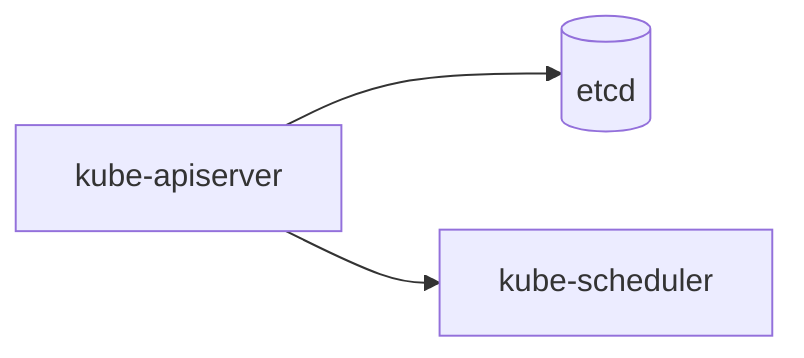

# phase-18-wiki-diagrams — diagrams for hard-to-read concept and entity pages

**Status:** design spec, agreed 2026-09-17. Implementation plan follows in `implementation.md` (writing-plans output); no `prd.json` unless the plan is later decomposed.

**Goal:** Pages under `wiki/concepts/` and `wiki/entities/` explain architectures, flows and hierarchies in prose and tables only, and a reader has to rebuild the picture in their head. This phase lets the librarian draw that picture — as Mermaid text inside the page — and makes the site render it, lint check it, and the ingest flow produce it going forward.

**Not in scope:** AI image generation, general internet image search, diagrams on `sources/`, `analysis/` or `overview.md`, build-time SVG rendering, Mermaid syntax validation in Python.

---

## 1. Decisions (brainstorm record)

| Question | Decision | Why |
|---|---|---|
| Where do images come from | Agent-drawn Mermaid by default. Third-party images only when the ingested source itself is official documentation with an explicit licence, and only after human approval. No general web image search. | `wiki/` is public: copying blog images is a copyright exposure. Web image search is slow (2–3 fetches per candidate) and English-labelled images drift from the Korean body text. Mermaid labels reuse the body's exact terms. |
| When | At ingest (new pages) plus a one-shot backfill of the existing pages via a new `wiki-illustrate` skill. | Both halves are needed; the backfill is a content-mode session after this code-mode phase merges. |
| Which pages | `concepts/` and `entities/` only. | Structure lives there. A source summary re-drawing the same architecture would duplicate the concept page's diagram. |
| Rendering | Mermaid fenced blocks, rendered in the browser from a pinned jsdelivr CDN build. | Text (diffable, lintable), GitHub renders `wiki/*.md` previews natively, dark-mode theme support, Korean labels work, one script tag. Build-time SVG needs Chromium + Korean fonts in CI; hand-written SVG is unrealistic for 40 pages. |
| Presence enforcement | Lint validates diagrams that exist; it never requires one. | A machine cannot judge which page is "hard". The skills apply the criteria; lint checks the form. |
| S3 / CloudFront | No change. | `aws s3 sync site/dist` already covers every file in `dist/` (new `assets/` fall in the short-cache pass); no response-headers policy or CSP exists; Mermaid loads from the CDN, not S3; `deploy.yml` `paths:` already includes `wiki/**`. |

---

## 2. Content rules (→ `docs/rules/wiki-content.md`, new §1.4 "그림")

**Form.** A diagram is a Mermaid fenced block followed by a caption. No separate file.

````markdown

*그림 1. 컨트롤 플레인 다섯 부품과 요청 흐름 (→ [[sources/kubernetes-components|#34 쿠버네티스 컴포넌트]])*
````

**Rules.**

1. **Placement.** Directly below the section it illustrates — prose first, diagram after. Never inside `## 한눈에 요약`.
2. **Caption required.** The line after the fence (one blank line allowed) is `*그림 N. <설명> (→ [[sources/<slug>|label]])*` — italic, numbered from 1 per page, with at least one source citation in the standard alias form (§4.2). A diagram is a claim; an uncited diagram is an uncited claim.
3. **Labels reuse body terms.** Every node label is a term the body already uses, in Korean where the body uses Korean. Do not draw a component or an arrow the body (and its cited source) does not state.
4. **Cap.** At most 3 diagrams per page; 1 is the norm.
5. **Allowed types** (first line of the fence): `flowchart`, `sequenceDiagram`, `classDiagram`, `stateDiagram-v2`, `timeline`. Others are rejected by lint so a page never ships a block the CDN build cannot render.
6. **Draw only when** one of these holds, and a table would not do the job: ≥3 components with relationships between them; a flow of ≥3 steps; a layered or containment hierarchy.
7. **Scope.** `concepts/` and `entities/` only.

**Official-documentation image exception.**

- Allowed only when the ingested source is official documentation carrying an explicit licence (e.g. kubernetes.io, CC BY 4.0).
- Stored at `wiki/assets/<page-slug>/<name>.png|svg`; referenced as `` with the same caption form plus the licence and origin: `*그림 N. … (출처: <URL>, CC BY 4.0) (→ [[sources/…|…]])*`.
- **Human gate.** The agent posts the candidate (URL, licence text as found on the page, what it shows) in chat and writes nothing under `wiki/assets/` until the human approves.
- This phase ships the rule and the `assets/` copy in the build; no image is added unless a real candidate appears during the pilot.

---

## 3. Site (`site/build.py`, `site/style.css`, `scripts/verify_site.py`)

**`build.py`.**

1. Fence renderer hook on the existing `md` instance: when `token.info.strip() == "mermaid"`, emit `<pre class="mermaid" data-pagefind-ignore>` + HTML-escaped source + `</pre>`; every other fence keeps the default renderer. (`link_wikilinks`/`render_citations` already skip fence interiors via `outside_fences`, so the source reaches the renderer untouched.)
2. In `base_html`, when the rendered body contains `class="mermaid"`, append one `<script type="module">` that imports `https://cdn.jsdelivr.net/npm/mermaid@11.17.2/dist/mermaid.esm.min.mjs` (11.17.2 is the last 11.x, released 2026-08-25; 12.0.0 landed 2026-09-10 and is one week old — bump after it settles), calls `mermaid.initialize({ startOnLoad: false, theme: document.documentElement.dataset.theme === "light" ? "neutral" : "dark" })`, stores each block's source in `dataset.src`, runs `mermaid.run()`, and re-renders from `dataset.src` when `#theme-toggle` is clicked. Pages without a diagram get no script.
3. If `wiki/assets/` exists, `shutil.copytree(WIKI / "assets", DIST / "assets", dirs_exist_ok=True)` next to the existing `style.css` copy.

**`style.css`.** `.mermaid` — centered, `margin` above/below, `svg { max-width: 100% }`; caption selector `pre.mermaid + p > em` — smaller, muted colour. Same treatment for an `/assets/` image: `p:has(> img[src^="/assets/"]) + p > em`.

**`verify_site.py`.** One check: every file under `wiki/assets/` has a byte-identical copy under `dist/assets/` and vice versa. Existing raw-leak checks unchanged.

**`docs/rules/site-code.md`.** Add Mermaid to the runtime-CDN note (same paragraph family as Pretendard / Pagefind), with the pinned version 11.17.2 and the "self-host later if the CDN becomes a problem" escape hatch.

---

## 4. Lint (`scripts/lint_wiki.py`, `check_diagrams`)

Runs on every page; acts only when a page contains a ```` ```mermaid ```` fence or an `` image.

**Errors (exit 1).**

- Fence first line not one of the allowed types.
- No caption line matching `^\*그림 \d+\. .+\*$` within one blank line after the fence.
- Caption without a `[[sources/…|…]]` citation.
- More than 3 diagrams on one page.
- Diagram on a page whose `type` is `source`, `analysis` or `overview`.
- Diagram inside `## 한눈에 요약`.
- `/assets/` image whose file is missing under `wiki/assets/`, or whose caption lacks a licence marker (`CC BY`, `Apache`, `MIT`, `public domain` — a small list, extended as real cases appear).

**Warnings (exit 0).**

- Diagram numbers not consecutive from 1.

**Fixtures** (`tests/fixtures/`, consumed by `scripts/test_lint_wiki.py`): the golden wiki gains one valid diagram on a concept page; six new `defects/diagram-*` directories cover the type, caption, citation, cap, scope and summary-section errors, each with its `expect.txt`.

`# ponytail:` Mermaid syntax is not parsed — Python has no parser and the PR preview on GitHub renders the block, so a broken diagram is caught by eye at review. Upgrade path: a `mermaid-cli` step in CI if broken diagrams ever reach `main`.

---

## 5. Skills

**`wiki-ingest` (edit).**
- §1 "Understand the source": if the source is official documentation with a stated licence, note reusable diagram URLs and the licence text for the §2 exception.
- §4-2: when writing or updating a `concepts/`/`entities/` page, apply the §2 criteria; if they hold, add a Mermaid diagram with caption in the section it illustrates. Present any official-image candidate for approval before copying.

**`wiki-illustrate` (new, content mode).** Trigger: "그림 넣어 / 시각화 / 도식 / illustrate".

1. List `concepts/` and `entities/` pages with zero diagrams.
2. Per page, find the section that meets the §2 criteria. None → skip, record the reason in one line.
3. Draw: Mermaid + caption directly under that section, labels from the body, no relation the body does not state.
4. `python3 scripts/lint_wiki.py` must exit 0.
5. Bump `updated`; append `## [date] illustrate | 페이지 N쪽 그림 M장` to `docs/log.md`.
6. Report: pages touched, diagram count, skipped pages with reasons.

Human review happens on the PR (GitHub renders Mermaid). No per-diagram chat approval; the official-image exception is the only pre-approval gate. The skill never deletes or resolves contradictions — that stays with `wiki-lint`.

**`wiki-lint`.** No procedure change; the diagram warnings surface under the existing "가독성 경고" heading of its report.

**`CLAUDE.md` §3.** One routing line for `wiki-illustrate`, in the same form as the other content-mode skills.

---

## 6. Verification and phase layout

**Tests.**
- `site/test_build_site.py`: mermaid fence → `<pre class="mermaid" data-pagefind-ignore>`; script present only on diagram pages; a non-mermaid fence unchanged; `wiki/assets/` copied.
- `scripts/test_lint_wiki.py`: golden + the six defects above.
- `scripts/verify_site.py`: assets parity.
- Manual: build locally, open a diagram page, toggle theme — the diagram re-renders in the matching theme; Korean labels intact.

**Order of work (code mode, `feat/wiki-diagrams`, `Task: wiki-diagrams`, one commit per task).**

1. Rules: `wiki-content.md` §1.4, `site-code.md` CDN note, `CLAUDE.md` §3 line.
2. `lint_wiki.py` `check_diagrams` + fixtures (TDD).
3. `build.py` fence hook + script + assets copy + tests (TDD).
4. `style.css`.
5. `verify_site.py` assets check.
6. `wiki-ingest` edit + `wiki-illustrate` skill.
7. Pilot: one diagram on `wiki/concepts/kubernetes.md` (control plane / node split) to exercise the whole path: lint → build → browser.
8. `docs/index.md` entry; one `site` line in `docs/log.md` at close-out.

**Follow-up (content mode, separate session after merge).** Run `wiki-illustrate` over the remaining pages — one PR, diagrams reviewed in the PR preview.

**Verification gate for every task touching the site** (`docs/rules/site-code.md` §2.3): `lint_wiki.py` → `build.py` → `verify_site.py`.
