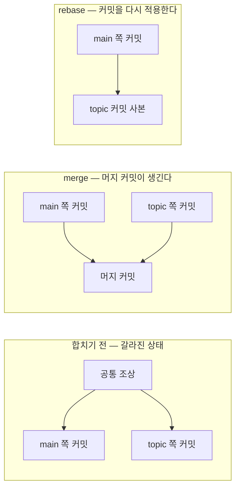

# 브랜치 합치기 — merge·rebase·cherry-pick

## 한눈에 요약

- 다른 갈래에서 한 작업을 내 갈래로 가져오는 명령이 셋 있다. 목적은 같고, 역사에 남기는 모양이 다르다.
- merge는 갈라진 두 끝과 공통 조상을 써서 합치고, 필요하면 부모가 둘인 머지 커밋을 새로 만든다 (→ [[sources/gitbook-branching-and-internals|#47 Pro Git 브랜치·내부]]).
- rebase는 내 커밋들의 변경분을 뽑아 대상 위에 차례로 다시 적용한다. 결과 스냅샷은 같고 **역사만 한 줄로 펴진다** (→ [[sources/gitbook-branching-and-internals|#47 Pro Git 브랜치·내부]]).
- 황금률 하나만 기억하면 된다. 이미 밖으로 내보낸 커밋은 rebase 하지 않는다 (→ [[sources/gitbook-branching-and-internals|#47 Pro Git 브랜치·내부]]).
- cherry-pick은 특정 커밋 하나의 변경만 떼어 와 새 커밋으로 적용한다 (→ [[sources/gitscm-command-manpages|#49 git 매뉴얼 11편]]).

## 세 명령은 같은 목적, 다른 방법

Git에서 한 브랜치의 변경을 다른 브랜치로 통합하는 주된 방법은 merge와 rebase 둘이다. 여기에 "커밋 하나만" 가져오는 cherry-pick을 더하면 실무에서 쓰는 도구가 얼추 채워진다 (→ [[sources/gitbook-branching-and-internals|#47 Pro Git 브랜치·내부]]·[[sources/gitscm-command-manpages|#49 git 매뉴얼 11편]]).

| 명령 | 가져오는 단위 | 새로 생기는 커밋 | 원래 커밋 해시 |
|---|---|---|---|
| `merge` | 갈래 전체 | 머지 커밋 1개 (fast-forward면 0개) | 그대로 남는다 |
| `rebase` | 갈래 전체 | 재적용된 커밋들 | **바뀐다** |
| `cherry-pick` | 커밋 하나씩 | 고른 커밋 수만큼 | 원본은 그대로, 사본이 생긴다 |

어느 쪽을 언제 쓸지는 [[analysis/merge-vs-rebase|merge vs rebase]]에서 따로 비교했다.

## merge — 포인터를 옮기거나, 공통 조상을 끼고 합치거나

merge는 상황에 따라 두 가지 전혀 다른 일을 한다. 이걸 모르면 "어떤 때는 커밋이 생기고 어떤 때는 안 생긴다"가 미스터리로 남는다.

### fast-forward

합치려는 커밋이 현재 커밋의 역사를 따라가면 닿는 자리에 있는 경우다. 갈라진 작업이 애초에 없으니 Git은 **브랜치 포인터를 앞으로 옮기기만 한다**. 이게 fast-forward다 (→ [[sources/gitbook-branching-and-internals|#47 Pro Git 브랜치·내부]]).

### 3-way merge

역사가 실제로 갈라졌으면 이야기가 달라진다. Git은 두 브랜치 끝의 스냅샷과 **공통 조상**, 세 지점을 써서 합친다. 이 공통 조상을 merge base라고 부른다 (→ [[sources/gitbook-branching-and-internals|#47 Pro Git 브랜치·내부]]).

합친 결과로 새 스냅샷을 만들고, 그것을 가리키는 커밋을 자동으로 만든다. 이 커밋이 머지 커밋이고, **부모가 둘 이상**이라는 점에서 특별하다 (→ [[sources/gitbook-branching-and-internals|#47 Pro Git 브랜치·내부]]).

커밋할 때 부모를 기록해 두기 때문에 merge base를 찾는 일은 Git이 알아서 한다. 사람이 "어디서 갈라졌더라"를 뒤질 필요가 없다 (→ [[sources/gitbook-branching-and-internals|#47 Pro Git 브랜치·내부]]).

> 3-way merge에는 알려진 함정이 하나 있다. 양쪽에서 같은 변경을 했다가 한쪽에서 되돌린 경우, 머지 결과에는 그 변경이 남는다. 머지가 두 끝점과 merge base만 보고 중간 커밋들은 보지 않기 때문이다. 매뉴얼도 "헷갈린다고들 한다"며 이 동작을 직접 적어 둔다 (→ [[sources/gitscm-command-manpages|#49 git 매뉴얼 11편]]).

## rebase — 커밋을 다시 적용한다

rebase의 정의는 매뉴얼 한 줄이면 끝난다. "일련의 커밋을 다른 출발점으로 이식한다" (→ [[sources/gitscm-command-manpages|#49 git 매뉴얼 11편]]).

하는 일을 순서대로 풀면 이렇다. 먼저 두 브랜치의 공통 조상으로 가서, 현재 브랜치의 각 커밋이 만든 diff를 뽑아 임시로 저장한다. 그다음 현재 브랜치를 대상과 같은 커밋으로 리셋하고, 저장해 둔 변경을 차례로 다시 적용한다 (→ [[sources/gitbook-branching-and-internals|#47 Pro Git 브랜치·내부]]).

여기서 핵심은 **다시 적용한 커밋은 다른 커밋이라는 것**이다. 내용은 같아도 부모와 시점이 달라지니 해시가 새로 나온다. 원래 커밋은 버려지고 비슷하지만 다른 커밋이 생기는 셈이다 (→ [[sources/gitbook-branching-and-internals|#47 Pro Git 브랜치·내부]]).

그러면 무엇이 남는가. 최종 결과 스냅샷은 merge를 했을 때와 **똑같다**. 다른 것은 역사의 모양뿐이다. 병렬로 일어난 일이 순서대로 일어난 것처럼 한 줄로 펴진다 (→ [[sources/gitbook-branching-and-internals|#47 Pro Git 브랜치·내부]]).

*그림 1. 같은 갈래를 merge로 합쳤을 때와 rebase로 옮겼을 때의 역사 모양 (→ [[sources/gitbook-branching-and-internals|#47 Pro Git 브랜치·내부]])*

> **황금률** — 이미 밖으로 내보낸 커밋은 rebase 하지 않는다. 원문은 "내 저장소 밖에 나가 있고 남이 그 위에 작업했을 수 있는 커밋은 rebase 하지 말라"고 적는다. 이미 push 한 커밋을 고쳐 강제로 다시 올리면 협업자는 같은 작업을 또 머지해야 한다. 그리고 작성자·날짜·메시지가 같은 커밋이 역사에 둘씩 보이게 된다 (→ [[sources/gitbook-branching-and-internals|#47 Pro Git 브랜치·내부]]).

밖으로 내보내기 전이라면 반대로 권장된다. 로컬 커밋을 push 전에 rebase로 정리해 두면, 받는 쪽은 fast-forward나 깨끗한 적용만 하면 된다 (→ [[sources/gitbook-branching-and-internals|#47 Pro Git 브랜치·내부]]).

## cherry-pick — 커밋 하나만 집어 온다

갈래 전체가 아니라 **그 커밋 하나의 변경만** 필요할 때가 있다. cherry-pick은 기존 커밋이 만든 변경을 지금 브랜치에 적용하고, 각각에 대해 새 커밋을 기록한다. 작업 트리가 깨끗해야 실행된다 (→ [[sources/gitscm-command-manpages|#49 git 매뉴얼 11편]]).

머지 커밋은 그냥 집어 올 수 없다. 어느 쪽을 주 갈래로 볼지 Git이 알 수 없기 때문이다. `-m <부모번호>`(`--mainline`)로 주 갈래를 지정해 줘야 그 부모 기준으로 변경을 재적용한다 (→ [[sources/gitscm-command-manpages|#49 git 매뉴얼 11편]]).

`-x`를 붙이면 커밋 메시지 끝에 "(cherry picked from commit …)" 줄이 붙는다. 공개 브랜치 사이에서 수정을 백포트할 때는 유용하지만, 내 개인 브랜치에서 가져올 때는 받는 사람에게 쓸모없는 정보라 쓰지 말라고 매뉴얼이 직접 권한다 (→ [[sources/gitscm-command-manpages|#49 git 매뉴얼 11편]]).

## 충돌이 났을 때

세 명령 모두 자동으로 합칠 수 없는 지점에서 멈춘다. 멈추는 자리와 빠져나오는 문이 조금씩 다르다.

| 명령 | 멈췄을 때 남는 표시 | 계속 | 취소 | 건너뛰기 |
|---|---|---|---|---|
| `merge` | 충돌 파일에 충돌 표식 | `--continue` | `--abort` | — |
| `rebase` | 첫 문제 커밋에서 정지 | `--continue` | `--abort` | `--skip` |
| `cherry-pick` | `CHERRY_PICK_HEAD`가 문제 커밋을 가리킴 | `--continue` | `--abort` | `--skip` |

해결 절차는 공통이다. 파일 안의 `<<<<<<<`·`=======`·`>>>>>>>` 표식을 찾아 한쪽을 고르거나 직접 합쳐 쓴 뒤, 표식 줄을 지우고 `git add`로 해결됐다고 표시한다. 스테이징하는 행위 자체가 Git에게 "이건 해결했다"는 신호다 (→ [[sources/gitbook-branching-and-internals|#47 Pro Git 브랜치·내부]]).

> `merge --abort`가 언제나 원상복구를 보장하지는 않는다. 머지를 시작할 때 커밋하지 않은 변경이 있었고 그것을 머지 도중에 또 고쳤다면, 시작 전 상태를 복원하지 못하는 경우가 있다고 매뉴얼이 경고한다 (→ [[sources/gitscm-command-manpages|#49 git 매뉴얼 11편]]).

## 머지 전략 — 기본은 ort

`-s` 옵션을 주지 않으면 Git이 내장 목록에서 고른다. 헤드 하나를 합칠 때는 `ort`, 그 이상을 한꺼번에 합칠 때는 `octopus`다 (2026-09 기준) (→ [[sources/gitscm-command-manpages|#49 git 매뉴얼 11편]]).

이름이 낯선데, `ort`는 "Ostensibly Recursive's Twin"의 두문자어다. 이전 기본 알고리즘이던 `recursive`를 대체하려고 쓰인 구현이라 붙은 이름이다 (→ [[sources/gitscm-command-manpages|#49 git 매뉴얼 11편]]).

그래서 오래된 글에서 `recursive`를 자주 보게 된다. 이력을 정리하면 이렇다 (2026-09 기준) (→ [[sources/gitscm-command-manpages|#49 git 매뉴얼 11편]]).

| 구간 | `recursive`의 지위 |
|---|---|
| v0.99.9k ~ v2.33.0 | 헤드 둘을 합칠 때의 **기본 전략** |
| ~ v2.49.0 | 기본에서 내려왔지만 별도 구현으로 남아 있음 |
| v2.50.0 ~ | `ort`의 **동의어**로 바뀜 |

## 함께 읽기

- [[analysis/merge-vs-rebase|merge vs rebase]] — 어느 쪽을 언제 쓸지, 그리고 왜 결론이 하나가 아닌지
- [[concepts/git-object-model|Git 동작 원리]] — 부모 포인터와 커밋 해시가 왜 이 이야기의 전부인지
- [[concepts/git-remote-sync|원격 저장소 동기화]] — pull이 내부에서 merge나 rebase를 부르는 자리
