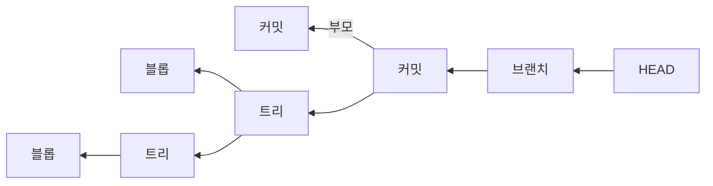

# Git 동작 원리 — 객체 모델

## 한눈에 요약

- Git은 파일의 변경분을 쌓는 게 아니라 커밋할 때마다 프로젝트 전체의 사진을 찍어 저장한다. 그 사진을 스냅샷이라고 부른다.
- 저장소는 내용을 넣으면 그 내용의 해시를 열쇠로 돌려주는 키-값 저장소다. 그래서 파일 이름이 아니라 내용이 주소가 된다 (→ [[sources/gitbook-branching-and-internals|#47 Pro Git 브랜치·내부]]).
- 객체는 블롭·트리·커밋·태그 네 종류뿐이고, 커밋이 부모를 가리키며 역사가 그래프로 이어진다 (→ [[sources/gitscm-docs-git|#48 git 명령 레퍼런스]]).
- 브랜치와 HEAD는 특별한 무엇이 아니라 커밋 해시를 적어 둔 40바이트짜리 파일이다 (→ [[sources/gitbook-branching-and-internals|#47 Pro Git 브랜치·내부]]).
- 이 구조 덕분에 손상은 해시로 잡히고, 거의 모든 연산이 네트워크 없이 로컬에서 끝난다 (→ [[sources/gitbook-what-is-git|#46 Pro Git Git이란]]).

## 델타가 아니라 스냅샷을 저장한다

다른 버전 관리 시스템을 써 봤다면 여기서 한 번 머리를 비우는 게 낫다. 명령 이름이 비슷해서 오히려 헷갈리기 때문이다 (→ [[sources/gitbook-what-is-git|#46 Pro Git Git이란]]).

CVS·Subversion·Perforce 같은 시스템은 "파일 목록 + 각 파일이 시간에 따라 어떻게 바뀌었는지"로 정보를 저장한다. 이걸 델타 기반(delta-based, 차이만 쌓는 방식) 버전 관리라고 부른다 (→ [[sources/gitbook-what-is-git|#46 Pro Git Git이란]]).

Git은 다르다. 커밋할 때마다 **모든 파일이 그 순간 어떤 모습인지 사진을 찍고, 그 스냅샷에 대한 참조를 저장한다**. 비유하자면 변경 목록이 아니라 사진첩을 쌓는 셈이다 (→ [[sources/gitbook-what-is-git|#46 Pro Git Git이란]]).

용량이 걱정될 텐데, 바뀌지 않은 파일은 다시 저장하지 않고 이전에 저장해 둔 동일 파일로의 링크만 남긴다. 그래서 사진첩을 쌓아도 부피가 그만큼 늘지는 않는다 (→ [[sources/gitbook-what-is-git|#46 Pro Git Git이란]]).

## 내용으로 주소를 매기는 키-값 저장소

Git의 가장 밑바닥은 content-addressable 파일시스템, 쉽게 말해 **내용을 넣으면 그 내용을 다시 꺼낼 열쇠를 돌려주는 키-값 저장소**다 (→ [[sources/gitbook-branching-and-internals|#47 Pro Git 브랜치·내부]]).

그 열쇠가 SHA-1 해시다. 16진수 40자 문자열이고, 내용과 짧은 헤더를 합친 것에서 계산된다. Git은 데이터베이스에 파일 이름이 아니라 **내용의 해시값으로** 모든 것을 저장한다 (→ [[sources/gitbook-what-is-git|#46 Pro Git Git이란]]·[[sources/gitbook-branching-and-internals|#47 Pro Git 브랜치·내부]]).

실제 저장 절차는 단순하다. 객체 유형과 바이트 수로 헤더를 만들어 내용 앞에 붙이고, 그 전체의 SHA-1을 구한 뒤, zlib으로 압축해 `.git/objects/` 아래 앞 두 글자 디렉터리와 나머지 38자 파일명으로 쓴다 (→ [[sources/gitbook-branching-and-internals|#47 Pro Git 브랜치·내부]]).

> 같은 내용이면 언제 어디서 넣든 같은 해시가 나온다. 중복 저장이 저절로 사라지는 것도, 손상이 즉시 드러나는 것도 여기서 온다.

## 객체 네 종류와 그래프

저장되는 객체는 네 종류뿐이다. 이름만 보면 어려워 보이지만 하는 일은 각각 하나씩이다 (→ [[sources/gitscm-docs-git|#48 git 명령 레퍼런스]]·[[sources/gitbook-branching-and-internals|#47 Pro Git 브랜치·내부]]).

| 객체 | 담는 것 | 비유 |
|---|---|---|
| 블롭(blob) | 파일 하나의 내용. 파일 이름은 담지 않는다 | 이름표 없는 내용물 |
| 트리(tree) | 블롭과 하위 트리의 목록 + 각각의 이름·모드 | 디렉터리 |
| 커밋(commit) | 최상위 트리 하나, 부모 커밋 0개 이상, 작성자·메시지 | 사진 한 장에 붙은 설명 |
| 태그(tag) | 커밋 등 객체 하나를 가리키는 이름표 + 태거·날짜·메시지 | 움직이지 않는 책갈피 |

커밋의 부모 포인터가 역사를 만든다. 최초 커밋은 부모가 0개, 보통 커밋은 1개, 머지로 생긴 커밋은 2개 이상이다. 부모가 둘 이상인 커밋이 곧 독립된 갈래가 합쳐진 자리다 (→ [[sources/gitbook-branching-and-internals|#47 Pro Git 브랜치·내부]]·[[sources/gitscm-docs-git|#48 git 명령 레퍼런스]]).

그래서 Git의 역사는 한 줄로 늘어선 목록이 아니라 **뒤로만 이어지는 그래프**다. 각 커밋이 자기 부모를 알 뿐, 자식은 모른다.

*그림 1. 커밋이 트리와 부모 커밋을 가리키고, 브랜치와 HEAD가 그 커밋을 가리킨다 (→ [[sources/gitbook-branching-and-internals|#47 Pro Git 브랜치·내부]])*

태그는 조금 다르다. lightweight 태그는 움직이지 않는 참조일 뿐이지만, annotated 태그를 만들면 태거·날짜·메시지를 담은 객체가 하나 더 생기고 참조는 그 객체를 가리킨다 (→ [[sources/gitbook-branching-and-internals|#47 Pro Git 브랜치·내부]]).

## 참조 — 브랜치와 HEAD는 그냥 파일이다

해시 40자를 외우고 다닐 수는 없다. 그래서 Git은 해시에 이름을 붙인 파일을 `.git/refs/` 아래 둔다. 이 이름들을 참조(reference), 줄여서 ref라고 부른다 (→ [[sources/gitbook-branching-and-internals|#47 Pro Git 브랜치·내부]]).

브랜치의 정체가 바로 이것이다. `refs/heads/` 아래에 커밋 해시 한 줄이 들어 있는 파일, 그 이상도 이하도 아니다. 새 브랜치를 만드는 비용은 41바이트(해시 40자와 줄바꿈 하나)를 쓰는 것뿐이라, 만들고 버리는 게 거의 공짜다 (→ [[sources/gitbook-branching-and-internals|#47 Pro Git 브랜치·내부]]).

HEAD는 한 겹 더 있다. 보통은 `ref: refs/heads/...`처럼 **다른 참조를 가리키는** 심볼릭 참조이고, 그래서 "지금 내가 어느 브랜치에 있는가"를 뜻한다. 커밋하면 Git은 HEAD가 가리키는 참조의 해시를 새 커밋의 부모로 적는다 (→ [[sources/gitbook-branching-and-internals|#47 Pro Git 브랜치·내부]]·[[sources/gitscm-docs-git|#48 git 명령 레퍼런스]]).

> 태그를 체크아웃하는 것처럼 브랜치가 아닌 지점으로 옮겨 가면 HEAD 파일에 브랜치 이름 대신 커밋 해시가 직접 들어간다. 이 상태를 detached HEAD라고 부른다 (→ [[sources/gitbook-branching-and-internals|#47 Pro Git 브랜치·내부]]).

참조의 세 번째 갈래가 원격 추적 브랜치다. `refs/remotes/` 아래에 있고, 마지막으로 통신했을 때 그 서버의 브랜치가 어디였는지를 적어 둔 읽기 전용 책갈피다. 자세한 것은 [[concepts/git-remote-sync|원격 저장소 동기화]]에서 다룬다 (→ [[sources/gitbook-branching-and-internals|#47 Pro Git 브랜치·내부]]).

## 세 트리 — 작업 디렉터리·인덱스·HEAD

`reset`이나 `checkout`이 헷갈리는 이유는 대개 여기를 건너뛰었기 때문이다. Git은 평소에 파일 묶음 세 개를 동시에 굴린다 (→ [[sources/gitbook-branching-and-internals|#47 Pro Git 브랜치·내부]]).

| 트리 | 역할 |
|---|---|
| HEAD | 마지막 커밋 스냅샷이자 다음 커밋의 부모 |
| 인덱스(스테이징 영역) | 다음 커밋이 될 후보 스냅샷 |
| 작업 디렉터리 | 실제 파일이 풀려 있는 모래밭 |

기본 흐름은 이 셋을 차례로 맞추는 일이다. 작업 디렉터리에서 고치고, `git add`로 인덱스에 복사하고, `git commit`으로 인덱스 내용을 영구 스냅샷으로 굳힌 뒤 브랜치를 그 커밋으로 옮긴다. 세 트리가 모두 같아지면 `git status`는 아무것도 말하지 않는다 (→ [[sources/gitbook-branching-and-internals|#47 Pro Git 브랜치·내부]]).

파일 쪽에서 보면 이게 세 가지 상태다. modified는 고쳤지만 아직 커밋되지 않은 것, staged는 다음 커밋에 넣겠다고 표시한 것, committed는 로컬 DB에 안전히 저장된 것이다 (→ [[sources/gitbook-what-is-git|#46 Pro Git Git이란]]).

> 여기서 헷갈리기 쉬운데, 추적 중인 파일을 고친 상태는 modified이지 untracked가 아니다. untracked는 Git이 역사에 아예 갖고 있지 않은 파일을 가리킨다. [[sources/kodekloud-how-git-works|#50 KodeKloud Git 내부]]는 "스테이징 전까지 untracked"라고 적는데, 공식 문서의 정의는 위와 같다 (→ [[sources/gitbook-what-is-git|#46 Pro Git Git이란]]).

인덱스에는 한 가지 덧붙일 게 있다. 머지가 진행 중일 때는 한 경로에 대해 여러 판본(stage)을 동시에 들고 있을 수 있다. 충돌 중인 파일의 양쪽 판본이 거기 얹혀 있는 것이다 (→ [[sources/gitscm-docs-git|#48 git 명령 레퍼런스]]).

## 이 모델이 주는 것 — 무결성과 속도

모든 것이 저장 전에 체크섬 계산되고 그 체크섬으로 참조되기 때문에, Git 모르게 파일이나 디렉터리 내용을 바꾸는 것이 불가능하다. 전송 중 손상이나 파일 깨짐도 Git이 탐지한다. 이 장치는 맨 아래층에 박혀 있다 (→ [[sources/gitbook-what-is-git|#46 Pro Git Git이란]]).

두 번째는 속도다. 역사 전체가 로컬에 있으니 로그 조회도, 한 달 전 파일과의 diff도 서버에 묻지 않고 바로 계산한다. 오프라인에서 커밋을 쌓아 두었다가 나중에 올릴 수 있는 것도 같은 이유다 (→ [[sources/gitbook-what-is-git|#46 Pro Git Git이란]]).

세 번째는 안전이다. Git의 동작은 거의 전부 데이터베이스에 **더하기만** 한다. 그래서 한 번 커밋한 것은 잃기 어렵다. 다만 아직 커밋하지 않은 변경은 여전히 날릴 수 있다 (→ [[sources/gitbook-what-is-git|#46 Pro Git Git이란]]). 어떤 명령이 실제로 데이터를 파괴하는지는 [[concepts/git-undo|되돌리기]]에 정리했다.

## 겉과 속 — 포슬린과 플럼빙

공식 매뉴얼은 Git 명령을 두 층으로 나눈다. 우리가 매일 쓰는 고수준 명령이 포슬린(porcelain, 변기의 도기 부분), 그 아래에서 객체와 인덱스를 직접 만지는 저수준 명령이 플럼빙(plumbing, 배관)이다 (→ [[sources/gitscm-docs-git|#48 git 명령 레퍼런스]]).

이 구분은 취향이 아니라 약속이다. 플럼빙은 스크립트에서 쓰라고 만든 것이라 입출력과 옵션이 **훨씬 안정적으로 유지되고**, 포슬린은 사용자 경험을 개선하려고 바뀔 수 있다. 그래서 자동화에는 플럼빙을 쓴다 (→ [[sources/gitscm-docs-git|#48 git 명령 레퍼런스]]).

## 함께 읽기

- [[concepts/git-branch-integration|브랜치 합치기]] — 이 그래프에 갈래를 다시 합치는 방법
- [[concepts/git-undo|되돌리기]] — 세 트리를 어디까지 되감느냐가 명령을 가른다
- [[concepts/version-control|버전 관리 시스템]] — 이 모델이 왜 분산 방식에서 필요한지
