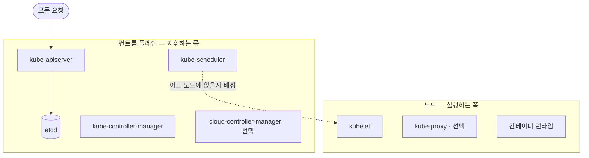

# 쿠버네티스 (Kubernetes)

## 한눈에 요약

- 여러 대의 서버를 묶어 컨테이너를 대신 배치·재시작·연결해 주는 시스템이다. 컨테이너란 앱과 실행 환경을 통째로 담아 어디서나 같게 돌아가게 만든 실행 단위를 말한다.
- 사람이 "이런 상태였으면 좋겠다"를 선언하면 클러스터가 그 상태에 맞춰 실제를 계속 끌어당긴다.
- 구현은 하나가 아니라 **배포판**이 여럿이다. CNCF 인증을 받으면 어느 배포판이든 표준 클러스터가 하는 일을 그대로 한다.
- 표준 부품은 쿠버네티스 공식 문서에서, 실제 배포판이 그걸 어떻게 꾸리는지는 경량 배포판 K3s의 문서에서 가져왔다. 둘이 섞이지 않도록 문장마다 출처를 붙였다.

## 클러스터는 두 층으로 나뉜다

왜 층을 나누는지부터 보면 이해가 빠르다. 컨테이너를 어디에 띄울지 정하는 일과 실제로 띄우는 일은 성격이 다르다. 그래서 지휘하는 쪽과 실행하는 쪽을 갈라 놓는다.

지휘하는 쪽이 **컨트롤 플레인**이다. 클러스터 전체 상태를 관리하며, 다섯 부품으로 나뉜다 (→ [[sources/kubernetes-components|#34 쿠버네티스 컴포넌트]]·[[sources/k3s-docs|#32 K3s 공식 문서]]).

| 컴포넌트 | 하는 일 |
|---|---|
| `kube-apiserver` | 쿠버네티스 HTTP API를 노출하는 핵심 서버. 모든 요청이 여기로 들어온다 |
| `etcd` | 모든 API 서버 데이터를 담는 일관성·고가용성 키-값 저장소 |
| `kube-scheduler` | 아직 노드에 할당되지 않은 파드를 찾아 적절한 노드에 배정한다 |
| `kube-controller-manager` | 컨트롤러를 실행해 선언한 상태와 실제를 계속 맞춘다 |
| `cloud-controller-manager` | 클라우드 공급자와 통합한다. **선택 사항** |

여기서 헷갈리기 쉬운데, 스케줄러는 파드를 **띄우지 않는다**. 어느 노드에 얹을지만 정해 주고 실제로 굴리는 일은 노드 쪽 `kubelet`이 맡는다 (→ [[sources/kubernetes-components|#34 쿠버네티스 컴포넌트]]).

실행하는 쪽은 각 노드에 있다. 모든 노드에서 돌면서 파드를 살아 있게 유지하는 부품들이다 (→ [[sources/kubernetes-components|#34 쿠버네티스 컴포넌트]]·[[sources/k3s-docs|#32 K3s 공식 문서]]).

| 컴포넌트 | 하는 일 |
|---|---|
| `kubelet` | 파드와 그 안의 컨테이너가 실행 중임을 보장한다 |
| `kube-proxy` | 노드의 네트워크 규칙을 유지해 서비스를 구현한다. **선택 사항** |
| 컨테이너 런타임 | 컨테이너를 실제로 실행하는 소프트웨어 |

`kube-proxy`가 선택 사항인 이유는 간단하다. 서비스 구현을 다른 부품이 대신 맡으면 이 자리는 비워도 된다.

노드에는 쿠버네티스 밖의 소프트웨어도 필요할 수 있다. 공식 문서는 리눅스 노드가 로컬 컴포넌트를 관리하려고 systemd를 함께 돌리는 경우를 예로 든다 (→ [[sources/kubernetes-components|#34 쿠버네티스 컴포넌트]]).

> 이 부품들을 어떻게 배치하느냐는 배포판마다 다르다. [[entities/k3s|K3s]]는 컨트롤 플레인 전부를 프로세스 하나에 담았고 그 덕에 로그 설정을 부품별로 나눌 수 없다는 대가도 같이 진다 (→ [[sources/k3s-docs|#32 K3s 공식 문서]]).

*그림 1. 클러스터의 두 층 — 컨트롤 플레인 다섯 부품과 노드 세 부품. 요청은 kube-apiserver로 모이고, 스케줄러는 배정만 하며 실제로 띄우는 일은 kubelet이 맡는다 (→ [[sources/kubernetes-components|#34 쿠버네티스 컴포넌트]]·[[sources/k3s-docs|#32 K3s 공식 문서]])*

## 부품을 더 얹는 자리 — 애드온

표준 부품만으로는 클러스터가 "돌아가기는 하지만 쓰기는 불편한" 상태에 가깝다. 그래서 기능을 얹는 자리를 따로 두는데 그게 **애드온**이다. 공식 문서가 중요한 예로 드는 넷은 다음과 같다 (→ [[sources/kubernetes-components|#34 쿠버네티스 컴포넌트]]).

| 애드온 | 하는 일 |
|---|---|
| DNS | 클러스터 전반의 이름 해석. 서비스 이름으로 서로를 부를 수 있게 해 준다 |
| 웹 UI (대시보드) | 웹 화면으로 클러스터를 들여다보고 관리 |
| 컨테이너 리소스 모니터링 | 컨테이너 메트릭을 모아 저장 |
| 클러스터-레벨 로깅 | 컨테이너 로그를 중앙 저장소에 모음 |

한마디로 애드온은 "없어도 클러스터는 뜨지만, 실제로 쓰려면 대부분 깔게 되는 것"이라고 보면 된다. 배포판이 이걸 미리 꽂아 주기도 한다 — [[entities/k3s|K3s]]가 CoreDNS와 [[entities/traefik|Traefik]]을 기본 탑재하는 것이 그 예다 (→ [[sources/k3s-docs|#32 K3s 공식 문서]]).

## 갈아 끼울 수 있게 만든 자리 — 인터페이스 표준

쿠버네티스는 핵심 기능 몇 개를 자기가 직접 구현하지 않고 **규격만 정해 두고 비워 놨다**. 그래야 환경마다 다른 선택을 꽂을 수 있기 때문이다.

| 규격 | 비워 둔 자리 | 구현체 예 |
|---|---|---|
| CRI (컨테이너 런타임) | 컨테이너를 실제로 실행 | containerd, cri-dockerd |
| CNI (네트워크) | 파드에 IP를 주고 노드 간 통신 | [[entities/flannel\|Flannel]], Calico, Cilium |
| CSI (스토리지) | 영구 볼륨 연결 | local-path-provisioner, Longhorn |
| CPI (클라우드 연동) | 노드 주소·로드밸런서 제공 | 각 클라우드의 CCM |

(→ [[sources/k3s-docs|#32 K3s 공식 문서]])

이 구조 때문에 배포판마다 "기본으로 뭘 꽂아 두느냐"가 달라진다. K3s는 네 자리 모두에 가벼운 기본값을 미리 꽂아 두고 마음에 안 들면 빼라는 방식을 택했다 (→ [[sources/k3s-docs|#32 K3s 공식 문서]]).

## 자주 마주치는 리소스

클러스터에 무언가를 시키는 방법은 결국 **리소스를 선언하는 것**이다. 종류가 많지만 처음에 부딪히는 것은 몇 개 안 된다.

| 리소스 | 하는 일 |
|---|---|
| 파드(Pod) | 컨테이너를 실제로 굴리는 최소 단위 |
| 서비스(Service) | 파드 묶음에 고정 주소를 준다. `ClusterIP`·`NodePort`·`LoadBalancer` 타입이 있다 |
| 인그레스(Ingress) | 클러스터 밖에서 들어오는 HTTP 트래픽을 서비스로 라우팅한다 |
| PV / PVC | 저장소 조각(PV)과 그걸 달라는 요청(PVC). 파드가 죽어도 데이터는 남는다 |
| DaemonSet | 노드마다 한 개씩 파드를 띄운다 |
| Job | 끝까지 돌고 완료되는 일회성 작업 |
| CRD | 쿠버네티스에 없는 새 리소스 종류를 추가하는 확장 장치 |

(→ [[sources/k3s-docs|#32 K3s 공식 문서]])

CRD가 특히 중요하다. 컨트롤러가 감시할 새 리소스를 정의할 수 있으니 클러스터 자체의 운영까지 선언형으로 바꿀 수 있다. K3s의 자동 업그레이드가 그 예다 — `Plan`이라는 CRD에 대상 노드와 버전을 적어 두면 컨트롤러가 노드마다 Job을 띄워 업그레이드를 수행한다 (→ [[sources/k3s-docs|#32 K3s 공식 문서]]).

## 버전과 접근 — 실수하기 쉬운 두 곳

**버전 스큐 정책**부터 보자. 서버가 에이전트(노드)보다 새로운 것은 괜찮지만 반대는 안 된다. 마이너 버전을 건너뛰는 업그레이드도 지원 범위 밖이다. 도구가 막아 주지 않으니 사람이 챙겨야 한다 (→ [[sources/k3s-docs|#32 K3s 공식 문서]]).

**클러스터 접근**은 kubeconfig 파일로 한다. K3s의 경우 `/etc/rancher/k3s/k3s.yaml`이 그 파일이다. 여기 담긴 자격은 `system:masters` 그룹이라 클러스터 안 모든 자원에 제한 없이 접근한다. 쿠버네티스가 하드코딩해 둔 무제한 권한이다 (→ [[sources/k3s-docs|#32 K3s 공식 문서]]).

> 이 파일을 복사해 쓰면 인증서 만료를 직접 챙겨야 한다. K3s는 시작할 때마다 원본 kubeconfig의 인증서를 갱신하지만 복사본까지 따라 갱신해 주지는 않는다 (→ [[sources/k3s-docs|#32 K3s 공식 문서]]).

## 정해진 아키텍처는 없다

마지막으로 입문자가 오해하기 쉬운 대목 하나. 위 부품들의 **배치 방식은 고정돼 있지 않다**. 공식 문서는 컴포넌트를 어떻게 배포하고 관리할지에 유연성이 있으며, 소규모 개발 환경부터 대규모 프로덕션까지 요구에 맞춰 조정된다고 밝힌다 (→ [[sources/kubernetes-components|#34 쿠버네티스 컴포넌트]]).

> 여기까지만 알아도 입문 단계는 충분하다. 부품 이름과 각자의 역할, 그리고 그 배치가 배포판마다 달라진다는 사실 — 이 셋을 잡고 나면 나머지는 필요할 때 찾아 읽으면 된다.

## 함께 읽기

- [[entities/k3s|K3s]] — 이 페이지의 근거가 된 경량 배포판
- [[entities/etcd|etcd]] — 클러스터 상태가 실제로 저장되는 곳
- [[entities/helm|Helm]] — 리소스 묶음을 패키지로 다루는 도구
- [[concepts/infrastructure-as-code|코드형 인프라]] — 선언형으로 인프라를 다룬다는 같은 발상의 이웃 갈래
- [[sources/kubernetes-components|#34 쿠버네티스 컴포넌트]] — 표준 부품 목록의 1차 출처. 입문자가 가장 먼저 읽을 한 쪽
