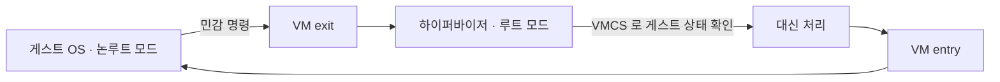

# 가상화 작동 원리

## 한눈에 요약

- 가상화의 기본 수법은 "게스트가 위험한 명령을 실행하려 하면 붙잡아서 대신 처리한다"이다. 이 붙잡기-대신처리하기를 trap-and-emulate라 부른다.
- 1974년 포펙과 골드버그가 어떤 기계에서 이 수법이 통하는지를 형식적으로 정리했고, x86은 그 조건을 만족하지 못했다.
- 그래서 나온 우회가 셋이다. 코드를 다시 쓰는 전가상화, 게스트 운영체제를 고치는 반가상화, 그리고 CPU에 전용 모드를 넣는 하드웨어 보조.
- 2005년 이후로는 하드웨어 보조가 기본이 됐고, 남은 승부처는 메모리와 입출력으로 옮겨 갔다.

## 어떤 기계가 가상화 가능한가 — 포펙·골드버그 1974

정의를 던지기 전에 왜 이런 이론이 필요했는지 한 문장으로 짚자. "이 CPU 위에서 효율적인 가상화가 가능한가"를 CPU를 만들기 전에 판정하고 싶었기 때문이다.

제럴드 포펙과 로버트 골드버그가 이를 1974년 논문에서 형식화했다. 논문 제목은 「Formal Requirements for Virtualizable Third Generation Architectures」다. VMM이 갖춰야 할 세 성질을 여기서 제시한다 (→ [[sources/wikipedia-virtualization-foundations|#40 위키백과 가상화 기초]]).

| 성질 | 내용 |
|---|---|
| 동등성(충실성) | VMM 아래에서 도는 프로그램이 같은 기계에서 직접 돌 때와 본질적으로 같게 동작해야 한다 |
| 자원 제어(안전성) | VMM이 가상화된 자원을 완전히 장악해야 한다 |
| 효율성(성능) | 기계 명령의 통계적으로 지배적인 비율이 VMM의 개입 없이 실행돼야 한다 |

세 번째 조건이 중요하다. 이것이 VMM을 하드웨어 에뮬레이터와 갈라놓는 기준이다 (→ [[sources/wikipedia-virtualization-foundations|#40 위키백과 가상화 기초]]).

### 명령어를 세 갈래로 나눈다

두 사람은 명령어 집합(ISA, 프로세서가 이해하는 명령의 전체 목록)을 세 부류로 나눴다 (→ [[sources/wikipedia-virtualization-foundations|#40 위키백과 가상화 기초]]).

- **특권 명령** — 사용자 모드에서 실행하면 트랩이 걸리고, 시스템 모드에서는 걸리지 않는 명령.
- **제어 민감 명령** — 시스템 자원의 구성을 바꾸려 드는 명령.
- **동작 민감 명령** — 동작이나 결과가 자원 구성에 따라 달라지는 명령.

**정리 1**이 결론이다. 어떤 3세대 컴퓨터든, 민감 명령 집합이 특권 명령 집합의 **부분집합**이면 효과적인 VMM을 만들 수 있다 (→ [[sources/wikipedia-virtualization-foundations|#40 위키백과 가상화 기초]]).

직관적으로 읽으면 이렇다. VMM의 올바른 동작을 해칠 수 있는 명령이 **전부 트랩을 걸어** 제어를 VMM에 넘기기만 하면 된다. 나머지 비특권 명령은 네이티브로 돌아 효율성을 지킨다.

그래서 구현 방법도 곧바로 나온다. 민감 명령이 전부 얌전히 트랩을 거니까, VMM은 그걸 붙잡아 에뮬레이트하기만 하면 된다. 이것이 **trap-and-emulate**, 요즘 말로 고전적 가상화다 (→ [[sources/wikipedia-virtualization-foundations|#40 위키백과 가상화 기초]]).

> 이 방식은 지금도 살아 있다. 리눅스 커널의 KVM 문서는 MIPS의 **기본 구현**을 여전히 "trap & emulate"라 부르고, 하드웨어 보조(VZ ASE)를 쓰려면 따로 지정하라고 적는다 (→ [[sources/kernel-kvm-docs|#42 KVM 커널 문서]]).

## x86은 왜 고전적으로 가상화가 안 됐나

문제는 x86이 정리 1의 조건을 만족하지 못한다는 것이었다.

펜티엄의 IA-32 명령어 집합에는 **민감하지만 특권이 아닌** 명령이 18개 있다 (→ [[sources/wikipedia-virtualization-foundations|#40 위키백과 가상화 기초]]). 이런 명령을 **임계 명령**이라 부른다. 민감한데 트랩이 안 걸리니, VMM이 붙잡을 기회 자체가 없다.

이 명령들은 두 묶음으로 나뉜다 (→ [[sources/wikipedia-virtualization-foundations|#40 위키백과 가상화 기초]]).

| 묶음 | 무엇을 건드리나 | 명령 |
|---|---|---|
| 민감 레지스터 계열 | 시계 레지스터·인터럽트 레지스터 같은 민감한 레지스터나 메모리 위치를 읽거나 바꾼다 | SGDT · SIDT · SLDT · SMSW · PUSHF · POPF |
| 보호 시스템 계열 | 저장 보호 체계, 메모리, 주소 재배치 체계를 참조한다 | LAR · LSL · VERR · VERW · POP · PUSH · CALL FAR · JMP FAR · INT n · RETF · STR · 세그먼트 레지스터 MOV |

> 개수는 집계 기준에 따라 다르게 인용된다. 여기서는 자료가 적은 대로 18개를 옮기되, 요점은 정확한 숫자가 아니라 **그런 명령이 존재한다**는 사실임을 밝혀 둔다.

Xen 원 논문은 이 사정을 더 날카롭게 적는다. x86에는 애초에 전가상화 지원이 설계에 들어 있지 않았다는 것이다. VMM이 처리해야 할 supervisor 명령을 권한이 모자란 상태에서 실행하면, **편리한 트랩이 걸리는 대신 조용히 실패한다** (→ [[sources/xen-sosp-2003-paper|#41 Xen 논문 2003]]).

비교해 보면 x86이 예외적인 쪽임을 알 수 있다. System/370과 PowerPC는 민감 명령이 전부 특권이라 요건을 만족한다 (→ [[sources/wikipedia-virtualization-foundations|#40 위키백과 가상화 기초]]).

## 우회 1 — 전가상화: 코드를 다시 쓴다

첫 번째 답은 게스트를 손대지 않고 VMM 쪽에서 전부 해결하는 것이었다. 게스트 OS는 자기가 가상화됐다는 사실조차 모른다.

### ring deprivileging

x86 보호 모드에서 커널은 가장 높은 권한인 **ring 0**에서 돌며 MMU를 설정하고 물리 메모리와 I/O를 직접 다룬다. 애플리케이션은 ring 3에 있다 (→ [[sources/wikipedia-virtualization-foundations|#40 위키백과 가상화 기초]]).

게스트 OS를 ring 0보다 낮은 권한으로 내려 앉히면, 특권 명령을 실행하려는 시도를 하이퍼바이저가 가로채 처리할 수 있다. 이것이 **ring deprivileging**이다 (→ [[sources/wikipedia-virtualization-foundations|#40 위키백과 가상화 기초]]).

### 세 가지 기법

보호 모드 가상화를 가능하게 한 기법은 셋이다 (→ [[sources/wikipedia-virtualization-foundations|#40 위키백과 가상화 기초]]).

| 기법 | 무엇을 하나 |
|---|---|
| 바이너리 변환 | ring 0 명령 일부를 ring 3에서도 안전한 명령열로 다시 쓴다. POPF처럼 ring 0 밖에서 조용히 실패하거나 다르게 동작하는 명령이 대상이다 |
| 섀도 페이지 테이블 | 게스트 OS에 실제 페이지 테이블 항목 접근을 막고, x86 MMU가 하던 일을 소프트웨어로 복제한다 |
| 장치 에뮬레이션 | 게스트가 지원하지 않는 장치를 호스트 OS 안의 장치 에뮬레이터가 흉내 낸다 |

변환한 블록은 캐시해 둬야 성능이 나온다. 다만 게스트 OS의 코드 패칭이나 페이지 재사용, 자기 수정 코드를 감지할 수 있게 일관성 있게 캐시해야 한다 (→ [[sources/wikipedia-virtualization-foundations|#40 위키백과 가상화 기초]]).

대가는 작지 않다. Xen 논문은 VMware ESX Server가 **게스트 OS 커널 전체**를 동적으로 재작성한다고 적는다. 트랩이 걸리지 않는 특권 명령을 하나도 놓치면 안 되기 때문이다. 섀도 페이지 테이블도 갱신 시도마다 트랩을 걸어 일관성을 유지하므로, 새 프로세스를 만드는 것처럼 갱신이 잦은 작업에서 비용이 크다 (→ [[sources/xen-sosp-2003-paper|#41 Xen 논문 2003]]).

> 논쟁거리가 하나 있다. 하드웨어 보조 없는 x86이 포펙·골드버그 의미에서 가상화 가능한가를 두고 이견이 있었다. VMware 연구진은 2006년 ASPLOS 논문에서 "위 기법들 덕에 세 기준을 충족한다 — 다만 고전적 trap-and-emulate 방식으로는 아니다"라고 주장했다 (→ [[sources/wikipedia-virtualization-foundations|#40 위키백과 가상화 기초]]).

## 우회 2 — 반가상화: 게스트를 고쳐 쓴다

두 번째 답은 발상을 뒤집는다. 하드웨어를 똑같이 흉내 내기가 어렵다면, **게스트 OS 쪽을 고치면** 되지 않나.

[[entities/xen|Xen]]은 하부 하드웨어와 "비슷하지만 똑같지는 않은" 가상 머신 추상화를 제시한다. 이 접근을 **반가상화**라 부른다. 게스트 OS는 고쳐야 하지만 ABI는 건드리지 않으므로 게스트 애플리케이션은 수정할 필요가 없다 (→ [[sources/xen-sosp-2003-paper|#41 Xen 논문 2003]]).

### ring 1로 내려 앉히기

x86에는 권한 링이 네 개 있는데, OS/2 이후로 ring 1과 2를 쓴 잘 알려진 x86 OS가 없다. Xen은 이 빈자리를 이용한다. 게스트 OS를 **ring 1**에서 돌게 고치면, 특권 명령을 직접 실행하지 못하면서도 ring 3의 애플리케이션과는 안전하게 갈린다 (→ [[sources/xen-sosp-2003-paper|#41 Xen 논문 2003]]).

### hypercall과 이벤트

그러면 게스트는 특권 작업을 어떻게 부탁하나. 두 방향의 통로가 따로 있다 (→ [[sources/xen-sosp-2003-paper|#41 Xen 논문 2003]]).

- **hypercall** — 도메인에서 Xen으로 올라가는 **동기** 소프트웨어 트랩이다. 보통 OS의 시스템 콜에 해당한다. 페이지 테이블 갱신 묶음을 한 번에 요청하는 것이 대표적인 쓰임이다.
- **이벤트** — Xen에서 도메인으로 내려가는 **비동기** 통지다. 하드웨어 인터럽트를 대신하며, 도메인별 비트마스크에 쌓인다. 유닉스 시그널과 비슷하다고 보면 된다.

I/O도 마찬가지로 에뮬레이션을 버렸다. 기존 하드웨어를 흉내 내는 대신 깔끔한 장치 추상화를 노출하고, 데이터는 공유 메모리 기반의 비동기 버퍼-디스크립터 링으로 오간다 (→ [[sources/xen-sosp-2003-paper|#41 Xen 논문 2003]]).

### Domain0

특권을 어디에 둘지도 설계의 일부다. Xen은 부팅 때 **Domain0**라는 첫 도메인을 만들고, 이 도메인만 제어 인터페이스를 쓸 수 있게 한다. 다른 도메인의 생성·종료, 스케줄링 파라미터, 물리 메모리 할당, 디스크·네트워크 접근 권한이 전부 여기서 결정된다 (→ [[sources/xen-sosp-2003-paper|#41 Xen 논문 2003]]).

정책과 메커니즘을 가르려는 선택이다. 하이퍼바이저는 기본 제어 동작만 제공하고, 복잡한 정책 판단은 Domain0의 게스트 OS 위에서 도는 관리 소프트웨어가 맡는다 (→ [[sources/xen-sosp-2003-paper|#41 Xen 논문 2003]]).

대가는 포팅 비용이다. 논문은 수정·추가된 줄 수로 Linux 2,995줄(x86 코드베이스의 1.36%), Windows XP 4,620줄(0.04%)을 보고한다 (→ [[sources/xen-sosp-2003-paper|#41 Xen 논문 2003]]).

## 우회 3 — 하드웨어가 거든다

2005년과 2006년, Intel과 AMD가 각각 독립적으로 x86 확장을 만들면서 판이 바뀌었다. **VT-x**와 **AMD-V**다. 서로 바이너리 호환되지 않는 두 갈래다 (→ [[sources/wikipedia-virtualization-foundations|#40 위키백과 가상화 기초]]).

| 항목 | Intel VT-x | AMD-V |
|---|---|---|
| 개발 코드명 | Vanderpool | Pacifica (초기 명칭 AMD SVM) |
| 첫 출시 | 2005-11-14, Pentium 4 모델 662·672 | 2006-05-23, Athlon 64 "Orleans"·Athlon 64 X2·FX "Windsor" |
| CPU 플래그 | `vmx` | `svm` |
| 명령 | VMX 13개 (VMPTRLD·VMXON·VMLAUNCH·VMRESUME 등) | VMRUN·VMLOAD·VMSAVE·CLGI·VMMCALL·INVLPGA·SKINIT·STGI |

(→ [[sources/wikipedia-virtualization-foundations|#40 위키백과 가상화 기초]])

> 자료 안에서 날짜가 엇갈린다. 같은 묶음의 "x86 virtualization" 문서는 2005-11-14로, "Virtualization" 문서는 2005-11-13으로 적는다. 프로세서 모델은 양쪽이 같다. 여기서는 x86 전용 문서 쪽을 따랐다 (→ [[sources/wikipedia-virtualization-foundations|#40 위키백과 가상화 기초]]).

### VMX 루트 모드와 VM exit

VMX 명령들이 하는 일은 새 실행 모드를 드나드는 것이다. 그 모드 안에서 게스트 OS는 자기가 완전한 권한(ring 0)으로 돌고 있다고 **인식하지만**, 호스트 OS는 여전히 보호된다 (→ [[sources/wikipedia-virtualization-foundations|#40 위키백과 가상화 기초]]).

x86에서 이 두 모드를 **루트 모드**와 **논루트 모드**라 부른다. 하이퍼바이저는 실제 하드웨어에 접근하는 루트 모드에, 게스트 커널과 애플리케이션은 논루트 모드에 있다. 양쪽 모두 ring 0에서 3까지를 그대로 갖는다 (→ [[sources/wikipedia-virtualization-foundations|#40 위키백과 가상화 기초]]).

게스트 상태는 **VMCS**(가상 머신 제어 구조)라는 메모리 자료구조에 담긴다. VM마다 정확히 하나씩 있고 VMM이 관리한다. 실행 문맥이 VM 사이를 오갈 때마다 해당 VM의 VMCS가 복원돼 가상 프로세서의 상태를 정의한다 (→ [[sources/wikipedia-virtualization-foundations|#40 위키백과 가상화 기초]]).

그래서 흐름은 이렇게 된다. 게스트가 논루트 모드에서 돌다가 하이퍼바이저가 처리해야 할 명령을 만나면 **VM exit**으로 루트 모드에 제어가 넘어간다. 하이퍼바이저는 VMCS를 보고 그 명령을 대신 처리한 뒤 **VM entry**로 게스트를 재개시킨다.

*그림 1. 민감 명령이 VM exit 을 일으켜 루트 모드의 하이퍼바이저로 제어가 넘어갔다가 VM entry 로 게스트에 돌아오는 경로 (→ [[sources/wikipedia-virtualization-foundations|#40 위키백과 가상화 기초]])*

여기서 오해하기 쉬운 대목 하나. 1세대 하드웨어 보조는 **특권 명령 문제만** 풀었다. 속도 이득은 거의 없었고, 실질적 성능 개선은 이후 세대 프로세서에서 왔다 (→ [[sources/wikipedia-virtualization-foundations|#40 위키백과 가상화 기초]]).

## 메모리 — 섀도 페이지 테이블에서 EPT로

남은 병목은 메모리였다. 가상화된 시스템 메모리의 성능 문제는 뒤에 칩셋에 추가된 MMU 가상화로 풀렸다 (→ [[sources/wikipedia-virtualization-foundations|#40 위키백과 가상화 기초]]).

무엇이 문제였나. 대부분의 OS가 페이징 가상 메모리를 쓰는데, 게스트 OS에 MMU 직접 접근을 허용하면 가상화 관리자가 통제권을 잃는다. 그래서 x86 MMU가 하던 일의 일부를 소프트웨어로 복제하는 **섀도 페이지 테이블**을 썼다 (→ [[sources/wikipedia-virtualization-foundations|#40 위키백과 가상화 기초]]).

Xen은 이 비용을 피하려고 아예 다른 길을 갔다. 게스트 OS 페이지 테이블을 MMU에 **직접 등록**하고 읽기 전용으로 묶은 뒤, 갱신은 hypercall로 받아 검증한다 (→ [[sources/xen-sosp-2003-paper|#41 Xen 논문 2003]]).

하드웨어 쪽 답은 2세대 확장이었다. AMD가 Opteron Family 0x10 Barcelona 계열부터 **RVI**를 넣었다 — 개발 중 이름은 Nested Page Tables 였다. Intel은 이를 **EPT**로 채택해 2008년 나온 Nehalem 아키텍처부터 포함했다 (→ [[sources/wikipedia-virtualization-foundations|#40 위키백과 가상화 기초]]).

> 메모리 가상화의 대가는 메인프레임 시절에도 같았다. 게스트가 스스로 가상 메모리를 구현하는 OS면, 비특권 명령조차 네이티브에서는 쓰지 않을 변환 테이블 접근 때문에 느려졌다 (→ [[sources/wikipedia-virtualization-foundations|#40 위키백과 가상화 기초]]).

## 입출력 — 에뮬레이션에서 패스스루까지

I/O는 네 단계로 올라간다. 순서대로 보면 왜 각 단계가 생겼는지가 보인다.

### 1단계 — 장치 에뮬레이션

게스트가 모르는 장치를 호스트 쪽 에뮬레이터가 흉내 낸다. 호환성은 최고지만 가장 느리다 (→ [[sources/wikipedia-virtualization-foundations|#40 위키백과 가상화 기초]]).

### 2단계 — 반가상 드라이버(virtio)

게스트가 자기가 가상화됐음을 알고 협력하면 훨씬 빨라진다. **virtio**는 드라이버와 장치가 통신하는 프로토콜의 공개 표준으로, 원래 하이퍼바이저가 구현하는 반가상 장치의 표준으로 개발됐다 (→ [[sources/virtio-and-firecracker-docs|#43 virtio·파이어크래커]]).

빠른 이유는 분명하다. 게스트 안 드라이버와 하이퍼바이저 안 장치가 **공유 메모리**로 통신하기 때문이다. 커널 문서가 바로 이 점을 virtio의 효율성 근거로 명시한다 (→ [[sources/virtio-and-firecracker-docs|#43 virtio·파이어크래커]]).

그 공유 메모리 구조가 **virtqueue**다. 버퍼 디스크립터의 링 버퍼이며, 디스크립터는 주소·길이·플래그·다음 인덱스를 담고 사슬처럼 이어진다. 버퍼는 게스트가 할당하고, 호스트는 읽기나 쓰기 둘 중 하나로만 쓴다 (→ [[sources/virtio-and-firecracker-docs|#43 virtio·파이어크래커]]).

Xen이 2003년에 쓴 I/O 링도 같은 발상이었다는 점을 짚어 두면 계보가 잡힌다 (→ [[sources/xen-sosp-2003-paper|#41 Xen 논문 2003]]).

### 3단계 — IOMMU 패스스루

더 빠르게 하려면 게스트에게 실제 장치를 통째로 주면 된다. **IOMMU**(입출력 메모리 관리 장치)는 게스트 VM이 이더넷·그래픽 카드·디스크 컨트롤러 같은 주변 장치를 DMA와 인터럽트 재매핑을 통해 직접 쓰게 해 준다. 이를 PCI 패스스루라 부른다 (→ [[sources/wikipedia-virtualization-foundations|#40 위키백과 가상화 기초]]).

규격은 AMD가 **AMD-Vi**, Intel이 **VT-d**라는 이름으로 각각 냈다. CPU만으로는 안 되고 메인보드 칩셋과 펌웨어도 지원해야 하며, 장치 쪽은 FLR(function level reset)을 지원해야 VM 사이에서 재할당할 수 있다 (→ [[sources/wikipedia-virtualization-foundations|#40 위키백과 가상화 기초]]).

덤으로 보안 효과도 있다. IOMMU는 버그가 있거나 악의적인 하드웨어가 메모리 보안을 무너뜨리는 것을 막아 준다 (→ [[sources/wikipedia-virtualization-foundations|#40 위키백과 가상화 기초]]).

### 4단계 — SR-IOV

패스스루의 한계는 장치 하나를 VM 하나가 독차지한다는 점이다. **SR-IOV**는 이를 푼다. 호스트 VMM이 지원 장치를 설정해 구성 공간의 가상 "섀도"를 여러 개 만들고 할당하면, 게스트가 그 자원에 직접 접근한다 (→ [[sources/wikipedia-virtualization-foundations|#40 위키백과 가상화 기초]]).

효과는 수치로 남아 있다. NASA의 가상화 데이터센터와 아마존 퍼블릭 클라우드에서 베어메탈 네트워크 대역폭의 95% 이상을 달성했다 (→ [[sources/wikipedia-virtualization-foundations|#40 위키백과 가상화 기초]]).

## 중첩 가상화

마지막으로 한 겹 더 쌓는 경우다. VMM 위에 또 VMM을 올리면, 섀도 페이지 테이블을 만들게 했던 것과 비슷한 문제가 다시 생긴다. VMCS를 여러 겹 섀도잉해야 하고, 프로세서 지원이 없으면 그 일부를 소프트웨어로 구현해야 한다 (→ [[sources/wikipedia-virtualization-foundations|#40 위키백과 가상화 기초]]).

Intel은 2013년 발표한 Haswell 마이크로아키텍처부터 **VMCS 섀도잉**을 하드웨어로 지원해 중첩 가상화를 가속한다 (→ [[sources/wikipedia-virtualization-foundations|#40 위키백과 가상화 기초]]).

> 재귀적 가상화 자체는 포펙·골드버그의 정리 2가 이미 다뤘다. 가상화 가능하고 타이밍 의존성이 없는 VMM을 만들 수 있으면 재귀적으로 가상화 가능하다는 조건이다 (→ [[sources/wikipedia-virtualization-foundations|#40 위키백과 가상화 기초]]).

## 함께 읽기

- [[concepts/virtualization|가상화]] — 이 원리들이 무엇을 위한 것인지의 큰 그림
- [[concepts/hypervisor|하이퍼바이저]] — 타입 1·2 구분과 관리 도구
- [[entities/xen|Xen]] — 반가상화를 실제로 구현한 하이퍼바이저
- [[entities/kvm|KVM]] — 하드웨어 보조를 전제로 리눅스 커널에 들어간 구현
- [[analysis/vm-vs-container|가상 머신 vs 컨테이너]] — 이 모든 기계장치가 없는 쪽과의 비교
