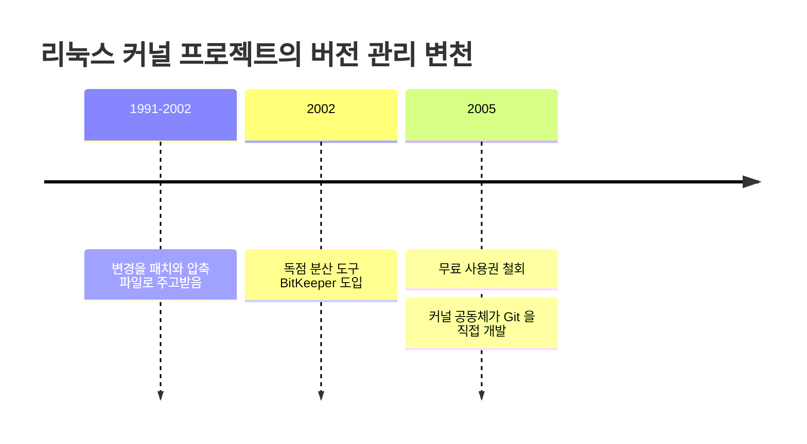

# Git

## 한눈에 요약

- 2005년 리눅스 커널 개발 공동체가 직접 만든 분산 버전 관리 시스템이다. 지금은 사실상 표준으로 쓰인다.
- 만들어진 계기가 기술 실험이 아니라 **도구 사용권 분쟁**이었다 (→ [[sources/gitbook-short-history-of-git|#45 Pro Git Git 역사]]).
- 속도·단순한 설계·수천 개 브랜치·완전 분산·커널 규모 처리, 다섯 가지가 처음부터 내건 설계 목표였다 (→ [[sources/gitbook-short-history-of-git|#45 Pro Git Git 역사]]).
- 공식 매뉴얼은 스스로를 "the stupid content tracker"라고 소개한다 (→ [[sources/gitscm-docs-git|#48 git 명령 레퍼런스]]).

## 어떻게 태어났나

Pro Git은 이 대목을 "약간의 창조적 파괴와 격렬한 논쟁에서 시작됐다"는 문장으로 연다. 순탄한 출발이 아니었다는 뜻이다 (→ [[sources/gitbook-short-history-of-git|#45 Pro Git Git 역사]]).

리눅스 커널은 1991년부터 2002년까지 버전 관리 도구 없이 굴러갔다. 변경을 패치와 압축 파일로 주고받으며 보관하는 방식이었다. 2002년에 프로젝트는 BitKeeper라는 독점 분산 버전 관리 도구를 도입한다 (→ [[sources/gitbook-short-history-of-git|#45 Pro Git Git 역사]]).

2005년, 커널 개발 공동체와 BitKeeper를 만든 상용 회사의 관계가 깨지면서 무료 사용권이 철회됐다. 이 일이 커널 공동체, 특히 [[entities/linus-torvalds|Linus Torvalds]]가 BitKeeper를 쓰며 배운 교훈을 바탕으로 자체 도구를 만들게 한 직접적 계기가 됐다 (→ [[sources/gitbook-short-history-of-git|#45 Pro Git Git 역사]]).

*그림 1. Git이 태어나기까지의 세 시기 (→ [[sources/gitbook-short-history-of-git|#45 Pro Git Git 역사]])*

> 흔히 따라붙는 "Git이라는 이름의 뜻" 이야기는 이 자료에 없다. 작명 경위가 원문에 나오지 않아 이 위키에는 적지 않는다 (→ [[sources/gitbook-short-history-of-git|#45 Pro Git Git 역사]]).

## 처음부터 내건 설계 목표

오늘날 Git의 특징으로 꼽히는 것들은 나중에 생긴 장점이 아니다. 2005년에 요구사항으로 먼저 적혀 있었다 (→ [[sources/gitbook-short-history-of-git|#45 Pro Git Git 역사]]).

| 목표 | 오늘날 어디서 드러나는가 |
|---|---|
| 속도 | 거의 모든 연산이 로컬 디스크에서 끝난다 |
| 단순한 설계 | 객체는 블롭·트리·커밋·태그 네 종류뿐이다 |
| 비선형 개발 지원 (수천 개 병렬 브랜치) | 브랜치가 41바이트짜리 파일이라 만들고 버리는 비용이 없다 |
| 완전한 분산 | clone 하나가 역사를 포함한 완전한 백업이다 |
| 대형 프로젝트를 효율적으로 | 커널 규모를 속도와 데이터 크기 양쪽에서 감당한다 |

문서는 "2005년 탄생 이후 Git은 쓰기 쉽게 다듬어지면서도 이 초기 성질들을 유지했다"고 정리한다 (→ [[sources/gitbook-short-history-of-git|#45 Pro Git Git 역사]]).

한국어 입문 자료들도 같은 지점을 짚는다. [[sources/tistory-inpa-git-concept|#51 Inpa Git 개념]]은 Git을 "분산형 버전 관리 시스템의 한 종류이며 빠른 수행 속도에 중점을 둔다"고 한 줄로 요약한다.

## 무엇이 다른가

Git이 다른 버전 관리 시스템과 갈라지는 지점은 데이터를 보는 방식이다. 대부분은 파일별 변경분을 쌓지만 Git은 **스냅샷을 쌓는다**. 그래서 Pro Git은 Git을 "VCS라기보다 강력한 도구가 얹힌 미니 파일시스템"이라고 부른다 (→ [[sources/gitbook-what-is-git|#46 Pro Git Git이란]]).

세대로 보면 Git은 분산 VCS에 속한다. 클라이언트가 최신 스냅샷만 받는 게 아니라 역사까지 저장소 전체를 복제하는 방식이다 (→ [[sources/gitbook-about-version-control|#44 Pro Git 버전관리란]]).

## 이 위키에서의 등장

- **버전 관리의 계보** — 로컬 → 중앙집중식 → 분산 세 세대 중 세 번째의 대표 사례로 나온다 ([[concepts/version-control|버전 관리 시스템]])
- **내부 구조** — 스냅샷·객체·참조·세 트리 모델의 설명 대상이다 ([[concepts/git-object-model|Git 동작 원리]])
- **일상 명령** — 합치기, 동기화, 되돌리기 세 갈래로 나눠 정리했다 ([[concepts/git-branch-integration|브랜치 합치기]]·[[concepts/git-remote-sync|원격 저장소 동기화]]·[[concepts/git-undo|되돌리기]])

## 함께 읽기

- [[entities/linus-torvalds|Linus Torvalds]] — 리눅스 커널과 Git을 모두 시작한 사람
- [[concepts/git-object-model|Git 동작 원리]] — 설계 목표가 실제 자료구조로 어떻게 내려왔는지
- [[concepts/version-control|버전 관리 시스템]] — Git 이전에 무엇이 있었고 무엇이 문제였는지
